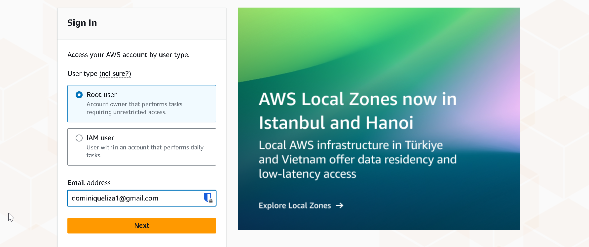
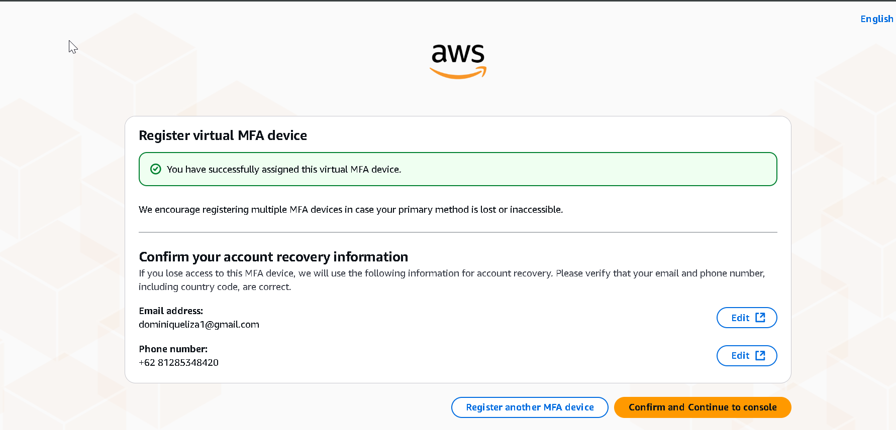
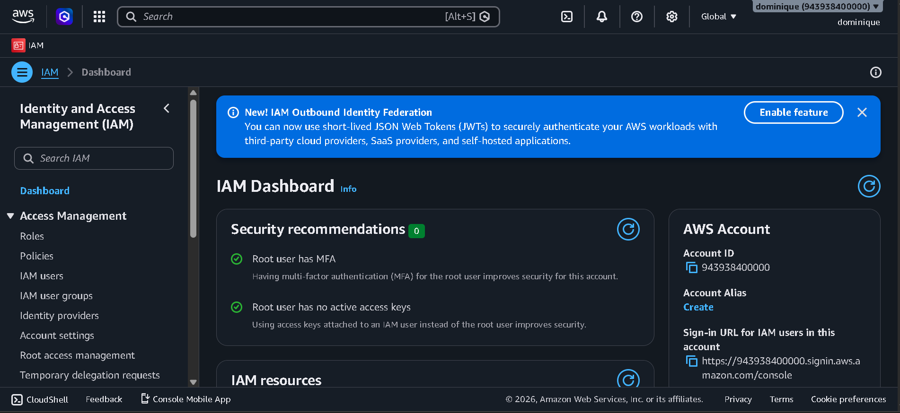
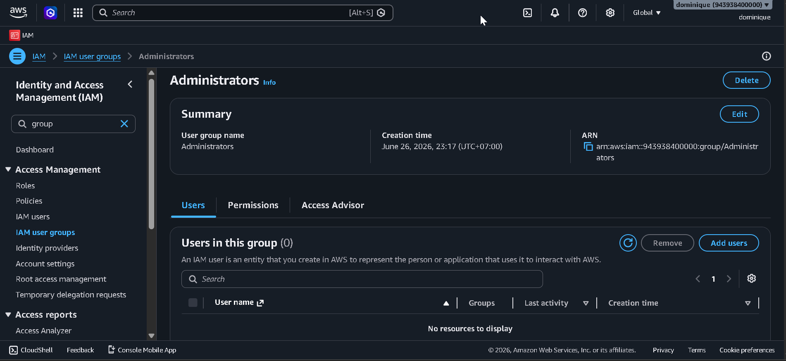
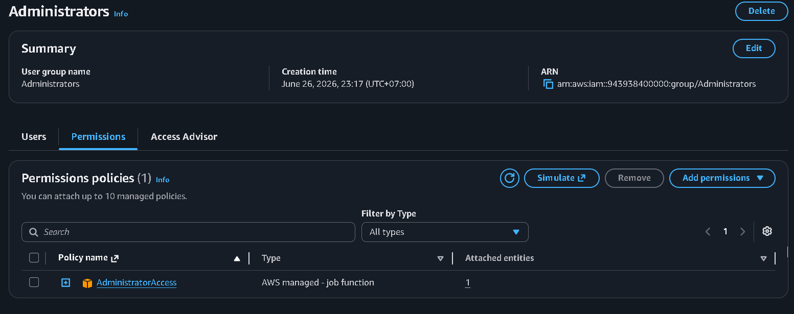
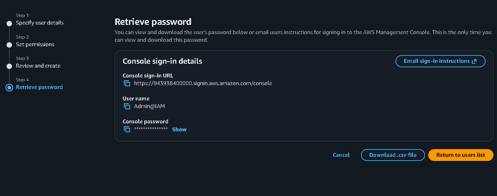
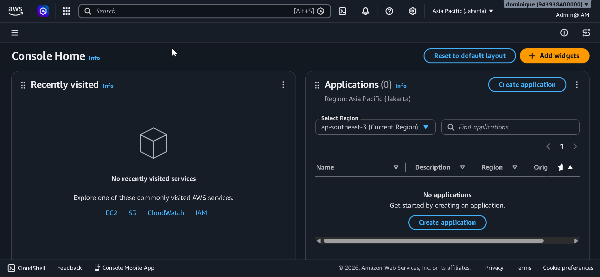
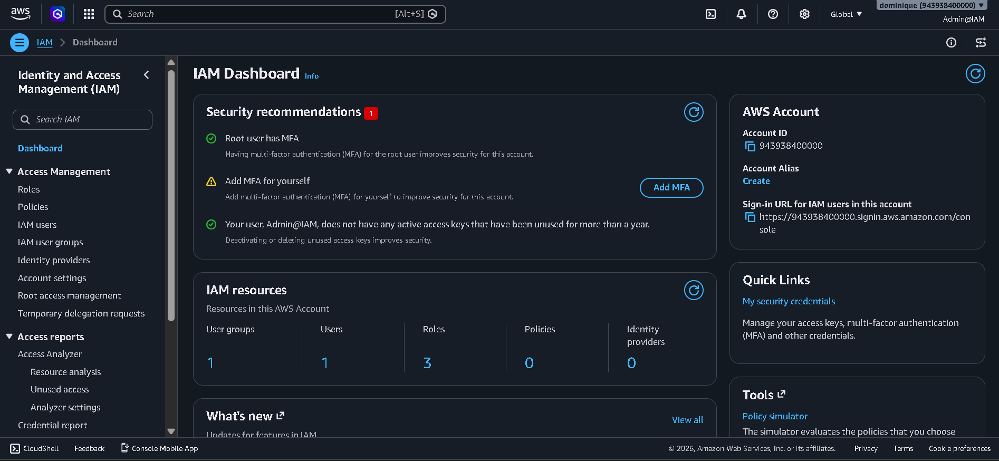

# AWS Security IAM Lab

## 📌 1. Project Objective
The objective of this lab was to gain hands-on experience with AWS Identity and Access Management (IAM) by implementing Role-Based Access Control (RBAC) and the Principle of Least Privilege (PoLP). 
The lab simulates a small organization's AWS environment by creating multiple departments, assigning only the permissions required for each role, and validating access controls through permission testing using different IAM users.

The lab focused on the following objectives :
- Create an AWS account
- Create IAM groups and attach AWS managed policies
- Create IAM users
- Assigning IAM users to groups
- Enabling Multi-Factor Authentication (MFA) for privileged accounts
- Verifying permissions by logging in each IAM user
- Demonstrating the Principle of Least Privilege (PoLP)
---

## ⚙️ 2. Lab Specifications & Tools

* **Cloud Platform:** Amazon Web Services (AWS)
* **Management Console:**
  - AWS Management Console
* **Account Type:**
  - AWS Free Plan (with promotional credits)
* **AWS Services Used:**
  - AWS Identity and Access Management (IAM)
  - Amazon EC2 (Permission Validation)
  - Amazon S3 (Permission Validation)
* **Security Concepts Implemented:**
  - Multi-factor Authentication (MFA)
  - Role-Based Access Control (RBAC)
  - Principle of Least Privilege (PoLP)
  - IAM Groups
  - IAM Users
  - AWS Managed Policies

---

## ⚠️ 3. Engineering Challenges & Troubleshooting

### Incident / Roadblock: 
During AWS account registration,the payment verification transaction was declined by the bank because the authorization amount was below the bank's minimum transaction threshold.

* **The Implementation Workflow:**

After the AWS account was successfully created and verified, the following steps were performed to configure AWS IAM and implement Role-Based Access Control (RBAC).
  1.  Signed in to the AWS Management Console as the Root User

      
      
  2. Enable Multi-Factor Authentication for the root account
     
      

  3. Opened the AWS Management Console and navigated to the IAM Dashboard

      
  
  4. Created Administrators IAM group and attached the following AWS managed policy : 
    - `AdministratorAccess`
      
      

  5. Created an IAM administrator user (Admin) with console access and added the user to the Administrators group
      
 
  6. signed out of the root account and signed in using the Admin IAM user. 
     
  
  7. Enabled Multi-Factor Authentication (MFA) for the Admin user
     
     
  
  8. Opened the IAM dashboard using the Admin account
     
   11. Created IAM groups for each department and attached the appropriate AWS managed policies:
       | IAM Group | Attached Policy | Purpose |
       | :--- | :--- | :--- | :--- | 
       | Administrators | `AdministratorAccess` | Full administrative access to AWS resources |
       | HR_Group | `AmazonS3ReadOnly` | Read-only access to Amazon S3 |
       | Finance_Group | `AmazonS3ReadOnly` | Read-only access to Amazon S3 |
       | IT_Group | `AmazonEC2FullAccess` | Full access to Amazon EC2 |
         
   12. Create IAM users of each department and put users to the appropriate IAM group:
       | User | Group | Policy | Directly Attached Policies |
       | :--- | :--- | :--- | :--- |
       | Admin | Administrators | AdministratorAccess | IAMUserChangePassword|
       | Alice_HR | HR_Group | AmazonS3ReadOnlyAccess | IAMUserChangePassword|
       | Bobby_IT | IT_Group | AmazonEC2FullAccess | IAMUserChangePassword|
       | Conan_Finance| Finance_Group| AmazonS3ReadOnlyAccess | IAMUserChangePassword|
      **Note:** Department-specific permissions were assigned through IAM   groups to follow Role-Based Access Control (RBAC). The `IAMUserChangePassword` policy was attached directly to each IAM user to allow users to change their own passwords after their initial login.
         
13. Enable Require password reset at next sign-in when creating each IAM user and attached the IAMUserChangePassword policy to allow users to change their own passwords.
14. Validated permissions by signing in as each IAM user and testing access to AWS services to verify the implementation of the Principle of Least Privilege (PoLP)

Permission Validation - Alice_HR

Assigned Permissions
- Group: `HR_Group`
- Group Policy: `AmazonS3ReadOnlyAccess`
- Directly Attached Policy: `IAMUserChangePassword`

Validation Tests
1. AWS IAM
- Attempted to access the IAM Dashboard.
- Result: Access denied.
- Reason: The user was not granted IAM administrative permissions. The only IAM permission available is the ability to change their own password the `IAMUserChangePassword`.

2. Amazon S3
- Attempted to access the Amazon S3 console and view the General Purpose Buckets page.
- **Result:** Access granted. The S3 console loaded successfully, although no buckets were available in the AWS account
- **Reason:** The `AmazonS3ReadOnlyAccess` policy allows read-only access to Amazon S3 resources.

3. Amazon EC2
- Attempted to access the EC2 Instances page.
- **Result:** Access denied (`ec2:DescribeInstances`).
- **Reason:** The HR group was not granted any Amazon EC2 permissions.

Conclusion
-The HR user successfully accessed Amazon S3, while access to IAM and EC2 was denied, confirming that the HR role follows the **Principle of Least Privilege (PoLP)**.

Permission Validation - Bobby_IT
Assigned Permissions
- Group: `IT_Group`
- Group Policy: `AmazonEC2FullAccess`
- Directly Attached Policy: `IAMUserChangePassword`

Validation Tests
1. AWS IAM
- Attempted to access the IAM Dashboard.
- Result: Access denied.
- Reason: The user was not granted IAM administrative permissions. the only IAM permission available is the ability to change their own password the `IAMUserChangePassword`.

2. Amazon S3
- Attempted to access the Amazon S3 console and view the General Purpose Buckets page.
- **Result:** Access denied.
- **Reason:** The IT Group was not granted any Amazon S3 permissions

3. Amazon EC2
- Attempted to access the EC2 Instances page.
- **Result:** Access granted 
- **Reason:** The `AmazonEC2FullAccess` policy allows full access to Amazon EC2 resources

Conclusion
- The IT user successfully accessed Amazon EC2 while access to IAM and Amazon S3 remained restricted, validating the assigned role permissions.

Permission Validation - Conan_Finance

Assigned Permissions
- Group: `Finance_Group`
- Group Policy: `AmazonS3ReadOnlyAccess`
- Directly Attached Policy: `IAMUserChangePassword`

Validation Tests
1. AWS IAM
- Attempted to access the IAM Dashboard.
- Result: Access denied.
- Reason: The user was not granted IAM administrative permissions. the only IAM permission available is the ability to change their own password the `IAMUserChangePassword`.

2. Amazon S3
- Attempted to access the Amazon S3 console and view the General Purpose Buckets page.
- **Result:** Access granted. The S3 console loaded successfully, although no buckets were available in the AWS account
- **Reason:** The `AmazonS3ReadOnlyAccess` policy allows read-only access to Amazon S3 resources.

3. Amazon EC2
- Attempted to access the EC2 Instances page.
- **Result:** Access denied (`ec2:DescribeInstances`).
- **Reason:** The Finance group was not granted any Amazon EC2 permissions.

Conclusion:
- The Finance user successfully accessed Amazon S3 while access to IAM and Amazon EC2 was denied, demonstrating the intended permission boundaries.

**Overall Permission Validation Summary**
- Permission validation was successfully completed for all IAM users. Each user was granted access only to the AWS services required for their assigned role while unauthorized access attempts were denied. These results confirm the successful implementation of Role-Based Access Control (RBAC) and the Principle of Least Privilege (PoLP) using AWS Identity and Access Management (IAM).

| IAM User | IAM | Amazon S3 | Amazon EC2 | Status|
| :--- | :--- | :--- | :--- |  :--- |
|Admin |✅|✅|✅| ✅Pass |
|Alice_HR |❌|✅ Ready-only|❌| ✅Pass |
|Bobby_IT|❌|❌|✅ Full Access| ✅Pass |
|Conan_Finance|❌|✅ Read-only|❌ | ✅Pass |
---

## 📊 4. Practical Execution & Findings

* **Activity Executed:**
  - Created an AWS account and signed in as the Root User.
  - Enabled Multi-Factor Authentication (MFA) for both the Root User and the Admin IAM user.
  - Accessed the AWS IAM Dashboard.
  - Created IAM groups and attached the appropriate AWS managed policies :
      + `AdministratorAccess` -> Administrators
      + `AmazonS3ReadOnlyAccess` -> HR Group 
      + `AmazonEC2FullAccess` -> IT group
      + `AmazonS3ReadOnlyAccess` -> Finance Group 
  - Created IAM users for each department
  - Attached the `IAMUserChangePassword` policy directly to each IAM user
  - Assigned each IAM user to the appropriate IAM group.
  - Validated permissions by signing in as each IAM user and testing access to AWS services.
  - Confirmed the successful implementation of Role-Based Access Control (RBAC) and the Principle of Least Privilege (PoLP).
    
* **Key Observations:**
  - IAM groups simplify permission management by allowing permissions to be assigned to groups instead of individual users.
  - The Root User should only be used for initial account configuration and emergency administrative tasks.
  - Multi-Factor Authentication (MFA) provides an additional layer of security for privileged accounts.
  - AWS managed policies enable quick implementation of common permission sets for different job roles.
  - Permission validation confirmed that users could access only the AWS services required for their assigned roles.
  - AWS returned Access Denied messages for unauthorized actions, confirming that the Principle of Least Privilege (PoLP) was correctly enforced.
  - Testing IAM permissions using multiple user accounts is an effective way to verify Role-Based Access Control (RBAC) configurations.
---

## 🚀 5. Key Takeaways & Career Alignment

* **Skill Demonstrated:**
  - AWS Identity and Access Management (IAM)
  - Role-Based Access Control (RBAC)
  - Principle of Least Privilege (PoLP)
  - Multi-Factor Authentication (MFA)
  - IAM Users and Groups
  - AWS Managed Policies
  - Permission Validation
  - Cloud Security Fundamentals
    
* **Next Steps:**
  - Configure AWS CloudTrail to monitor IAM activities.
  - Generate IAM login and permission events for audit analysis.
  - Analyze CloudTrail logs to understand user authentication and authorization events.
  - Implement Amazon CloudWatch monitoring for AWS account activity.
  - Replace AWS managed policies with custom IAM policies to provide more granular access control.
    
## 🛠 Skills Practiced
  - Amazon Web Services (AWS)
  - AWS Identity and Access Management (IAM)
  - Cloud Security
  - Role-Based Access Control (RBAC)
  - Principle of Least Privilege (PoLP)
  - Multi-Factor Authentication (MFA)
  - AWS Management Console
  - Security Validation
  - Permission Testing

### Career Alignment
  This project strengthened my understanding of AWS Identity and Access Management (IAM) by applying security best practices such as Role-Based Access Control (RBAC), Multi-Factor Authentication (MFA), and the Principle of Least Privilege (PoLP). These are foundational skills for entry-level roles such as Junior Cloud Security Engineer, Cloud Support Associate, and SOC Analyst.
