# AWS IAM Security Monitoring

## 📌 1. Project Objective
The objective of this lab was to gain hands-on experience with AWS CloudTrail by implementing activity monitoring in a simulated small company environment.

This lab simulates a company's AWS environment by monitoring management events across multiple AWS Regions, analyzing CloudTrail event history, and configuring CloudWatch alarms with Amazon SNS email notifications for security monitoring.

The lab focused on the following objectives:
* Configuring AWS Identity and Access Management (IAM) users, groups, and permissions based on the Principle of Least Privilege.
* Creating a multi-Region AWS CloudTrail trail to capture management events.
* Creating an Amazon S3 bucket to securely store CloudTrail logs.
* Generating IAM activities (such as creating and deleting users) to produce audit events.
* Validating IAM permissions and analyzing recorded events using CloudTrail Event History.
* Integrating AWS CloudTrail with Amazon CloudWatch Logs.
* Creating Amazon CloudWatch metric filters to detect IAM **CreateUser** events.
* Creating Amazon CloudWatch alarms to monitor security events.
* Configuring Amazon SNS to send real-time email notifications when an alarm is triggered.
* Verifying the end-to-end monitoring workflow by generating test events and confirming that alerts were successfully delivered.

---

## ⚙️ 2. Lab Specifications & Tools

* **Cloud Platform:** Amazon Web Services (AWS)
* **Management Console:**
  - AWS Management Console
* **Account Type:**
  - AWS Free Plan (with promotional credits)
* **AWS Services Used:**
  - AWS Identity and Access Management (IAM)
  - Amazon EC2 (Permission Validation)
  - Amazon S3 (Permission Validation)
  - Billing and Cost Management (Permission Validation)
  - AWS CloudTrail (Recording and Auditing AWS management events)
  - AWS CloudWatch (Log monitoring, metric filters, and alarms)
  - Amazon Simple Notification Service (Amazon SNS) 
* **Security Concepts Implemented:**
  - Multi-factor Authentication (MFA)
  - Role-Based Access Control (RBAC)
  - Principle of Least Privilege (PoLP)
  - IAM Groups
  - IAM Users
  - AWS Managed Policies
  - Security Monitoring
  - Audit Logging
  - Event-Driven Alerting

---

## ⚠️ 3. Engineering Challenges & Troubleshooting

### Incident / Roadblock: 
During the creation of the Amazon CloudWatch metric filter, the initial JSON filter pattern:
`{ $.eventName = "CreateUser" }` 
did not match the sample CloudTrail log events when tested using the **Test Pattern** feature.

To verify the monitoring workflow, a simpler text-based filter `"CreateUser"`was used instead. This filter successfully matched the CloudTrail log events containing the **CreateUser** API call, allowing the metric filter, CloudWatch alarm, and Amazon SNS email notification to function correctly.

This experience highlighted the importance of validating log formats and choosing an appropriate filter pattern based on the available log data.
* **The Implementation Workflow:**

## AWS CloudTrail Configuration
The following steps were performed to configure AWS CloudTrail for recording management events across multiple AWS Regions and storing audit logs in Amazon S3.
  1.  Signed in to the AWS Management Console as the **Admin** user and open the **AWS CloudTrail** console.

      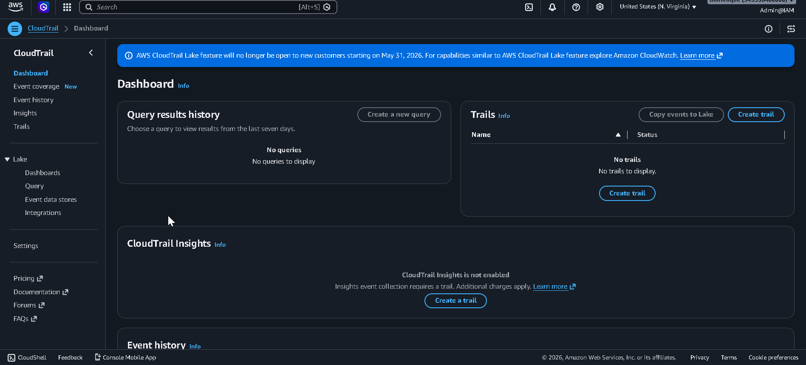
      
  2. Created a new CloudTrail trail with the following configuration:
      - Applied to **all AWS Regions (Multi-Region Trail)**
      - Enable **Management Events**
      - Recorded both **Read** and **Write** API activities
        
     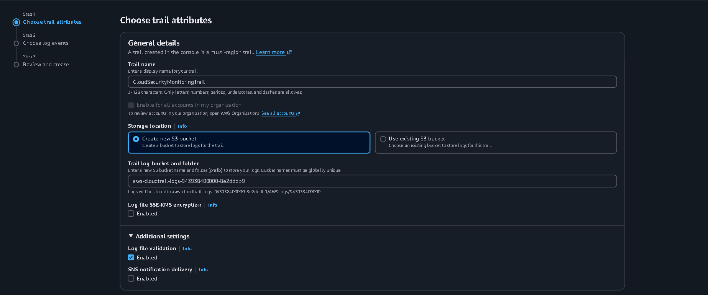
     
  3. Created a new Amazon S3 buckets to store CloudTrail log files.

     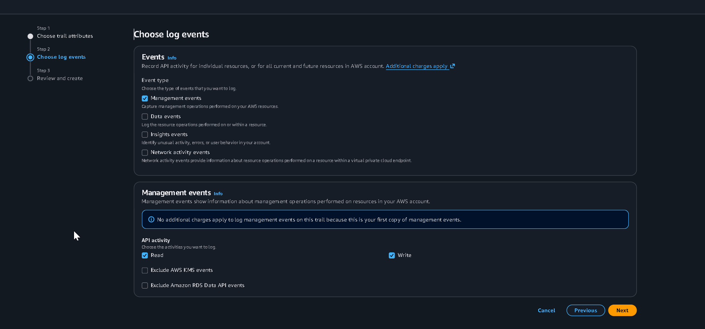
     
  4. Enabled integration with **Amazon CloudWatch logs** by creating a new log group for monitoring CloudTrail events.
     
      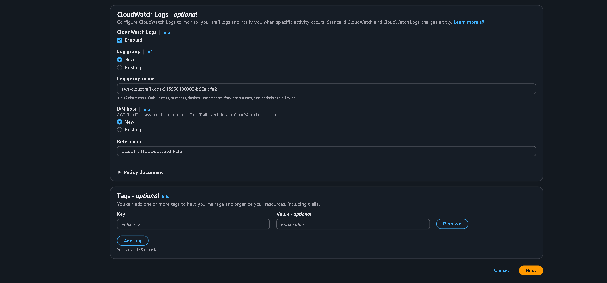
  5. Reviewed the configuration and successfully created the CloudTrail trail.
      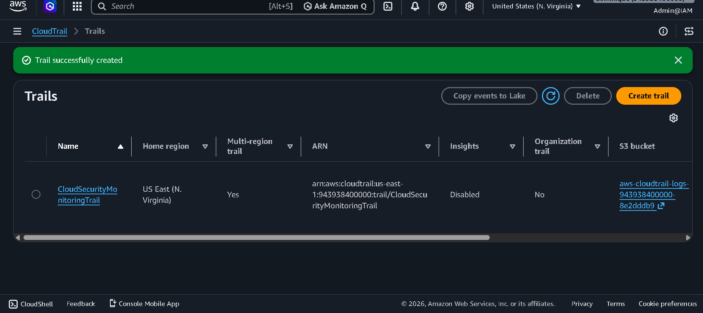
      
  6. Created a new IAM user named **Intern_HR** and added the user to the **HR_Group** to generate IAM management events for CloudTrail analysis

      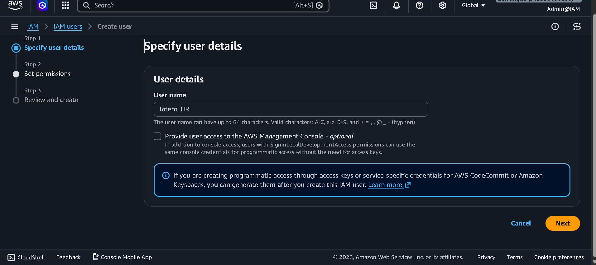
      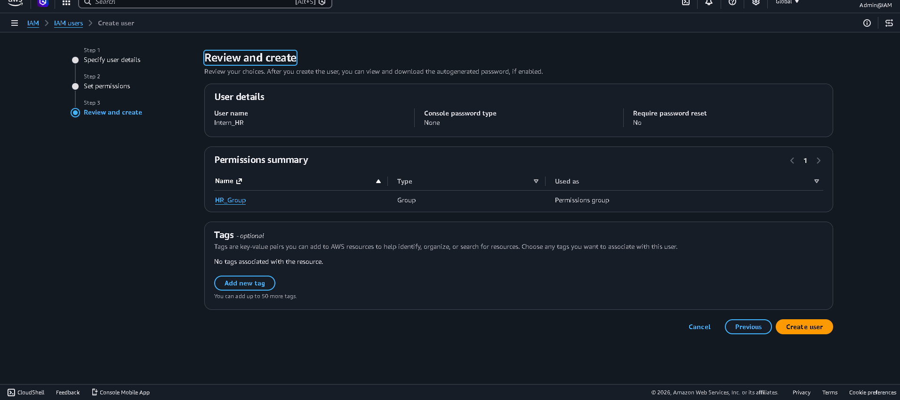
     
  7. Verified the generated events in **AWS CloudTrail Event History**.

     The following IAM management events were successfully recorded:
     -`CreateUser` : Recorded when the `Intern_HR` IAM user was created.
      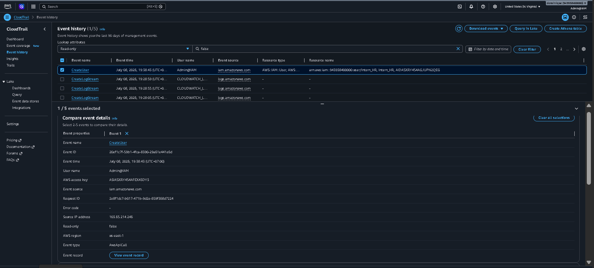     
     - `AddUserToGroup` : Recorded when the `Intern_HR` user was added to the **HR_Group**.
      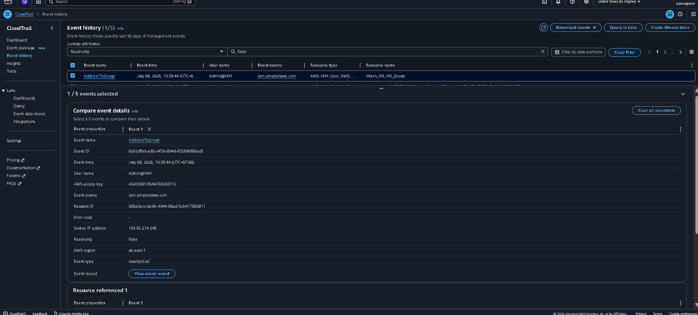
      
  8. Deleted the **Intern_HR** IAM user to generate addditional audit events.

     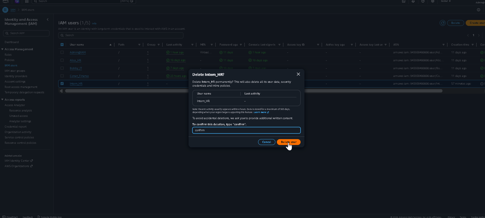
     
     Before deleting the user, AWS automatically removed the user from the associated IAM group because an IAM user cannot be deleted while group memberships still exist.

     The following events were recorded in **AWS CloudTrail Event History**:
      - **RemoveUserFromGroup** – Recorded when the user was automatically removed from the   **HR_Group**.
        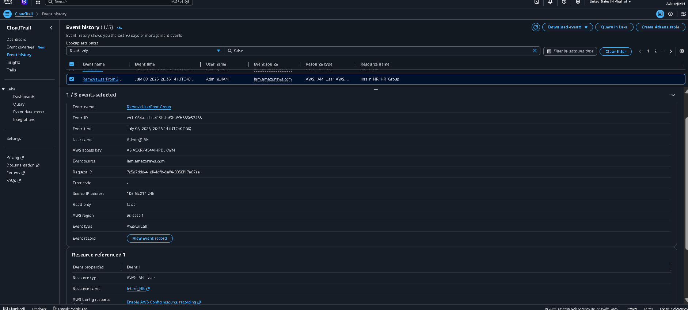
        
     - **DeleteUser** – Recorded when the `Intern_HR` IAM user was successfully deleted.
      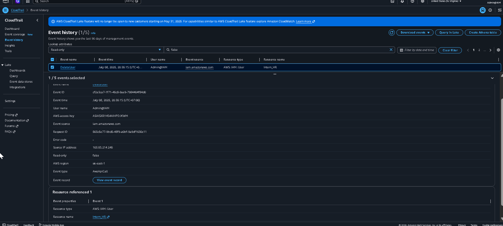

  9. Generate IAM Activity for CloudTrail Analysis
  to verify that AWS CloudTrail records IAM-related activities, several permission validation tests were performed using different IAM users. These activities generated CloudTrail management events that were later analyzed in **Event History**.

The following actions were performed:

| IAM User | Action | Expected Result | Actual Result | CloudTrail Event |
|----------|--------|-----------------|---------------|------------------|
| Alice_HR | Attempted to access Amazon EC2 | Access Denied | ❌ Access Denied | `DescribeInstanceTypes` (`Client.UnauthorizedOperation`) |
| Conan_Finance | Accessed AWS Billing & Cost Management | Success | ✅ Success | `ListBillingViews` |
| Bobby_IT | Started, stopped, and terminated an Amazon EC2 instance | Success | ✅ Success | `RunInstances`, `StopInstances`, `TerminateInstances` |

* Signed in as **Alice_HR** and attempted to access Amazon EC2. 
Access was denied because the IAM permissions assigned to the **HR_Group** did not allow EC2 actions.
AWS CloudTrail successfully recorded the unauthorized API call, demonstrating that failed management actions are also captured for auditing.
          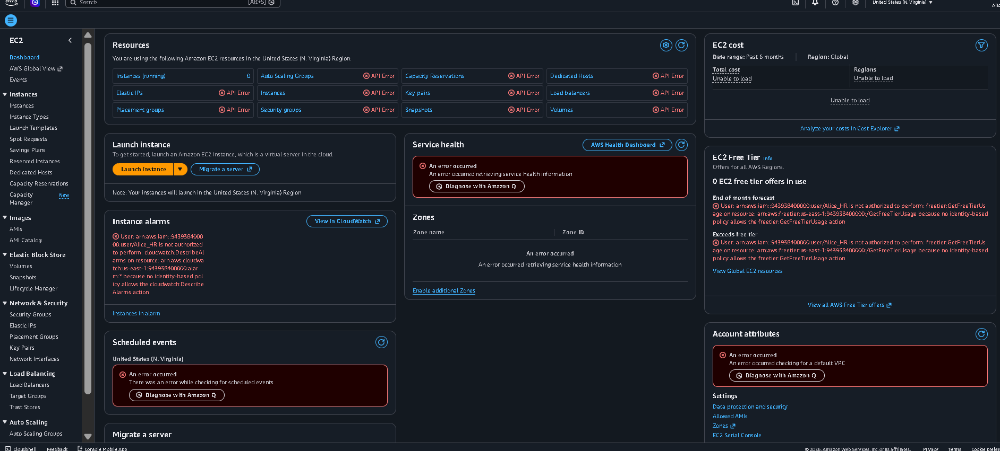
          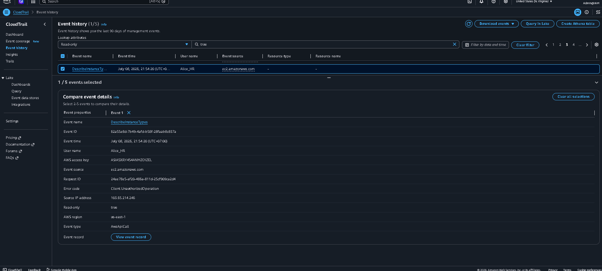
          
* Signed in as **Conan_Finance** and accessed the AWS Billing & Cost Management console.
The action was completed successfully because the required permissions were assigned to **Finance_Group**.
AWS CloudTrail recorded the corresponding management for auditing purposes.

  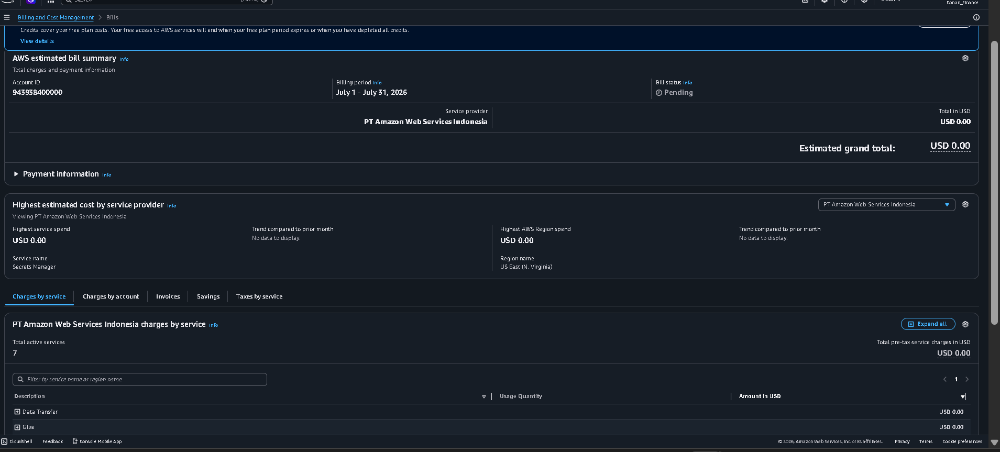
  
  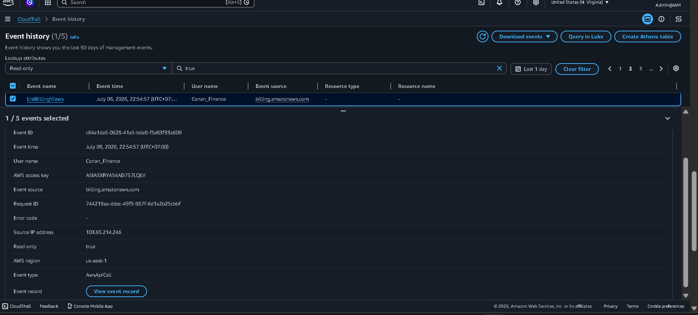

* Signed in as **Bobby_IT** and performed Amazon EC2 instance lifecycle operations to validate the permissions assigned to **IT_Group**.

#### EC2 Operations
**started the EC2 instance**

  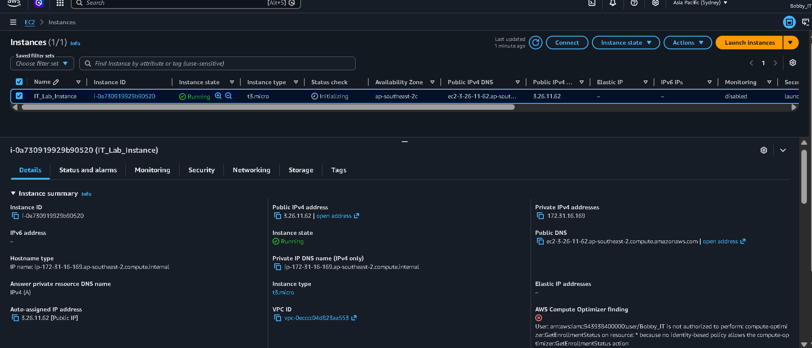
**Stopped the EC2 instance**

  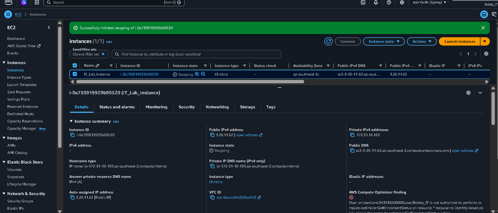
  
**Terminated the EC2 instance**

  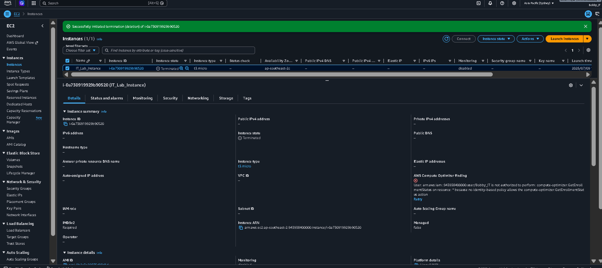

#### CloudTrail Events
 AWS CloudTrail successfully recorded each management event generated during the EC2 instance lifecycle operations.
  **RunInstances**
 
  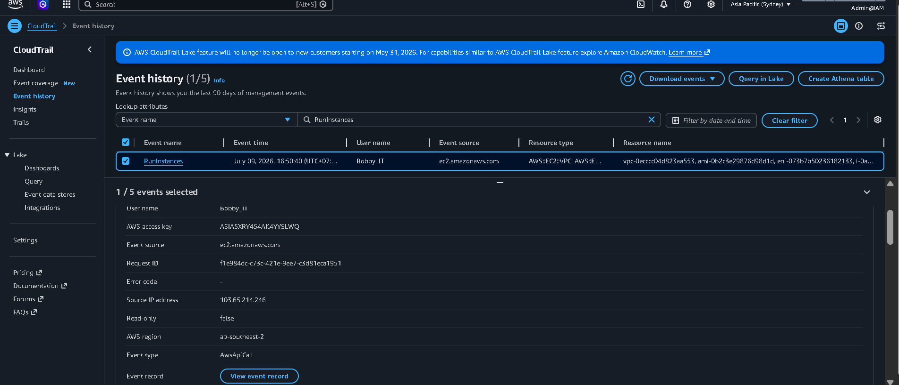
          
  **StopInstances**
  
  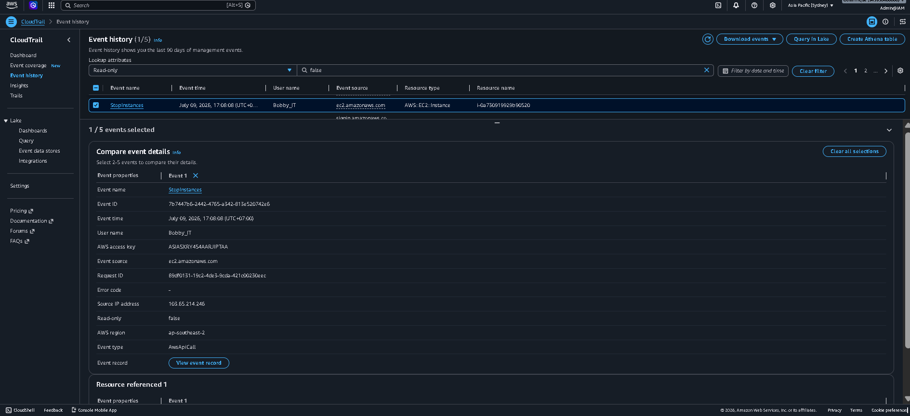
          
  **TerminateIntances**
  
  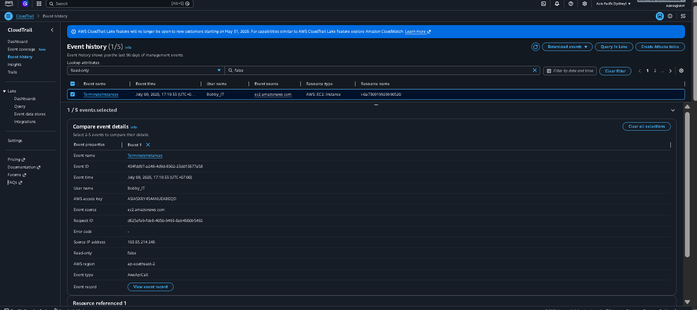
          
  10. Configure AWS CloudWatch Logs
Opened **Amazon CloudWatch Logs** and verified that AWS CloudTrail was successfully delivering management events to the configured log group.

The most recent log stream was opened to confirm that CloudTrail events were being ingested into CloudWatch Logs before creating monitoring rules.
  
   
   
  11. Create CloudWatch Metric Filter
Created a CloudWatch metric filter named **UserCreationEvents** to detect IAM user creation activities recorded by AWS CloudTrail.

The filter pattern used was:

```text
CreateUser
```
 **Note:** An initial attempt using the JSON filter pattern `{$.eventName = "CreateUser"}` did not match the CloudTrail log format during testing. The filter pattern was updated to `CreateUser`, which successfully detected the IAM user creation events.

  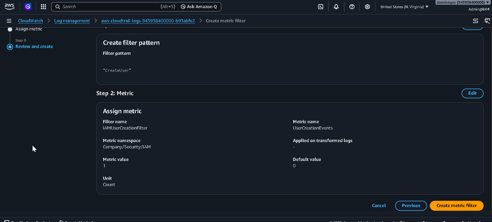

12. Create CloudWatch Alarm
Created a CloudWatch alarm to monitor the **UserCreationEvents** metric.

The alarm was configured to trigger whenever one or more IAM user creation events were detected within the monitoring period.

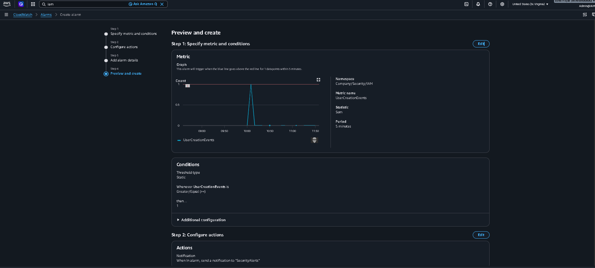

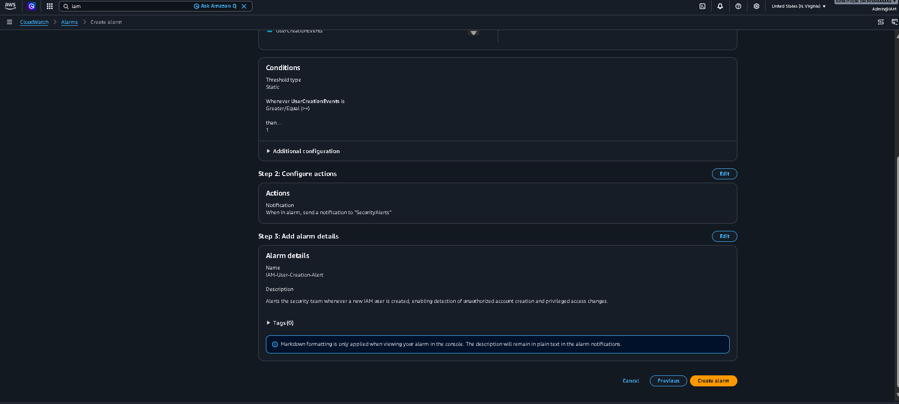

13. Configured an Amazon SNS topic to send email notifications whenever the **UserCreationEvents** CloudWatch alarm entered the **ALARM** state.

After confirming the email subscription, successful alarm notifications were delivered to the configured email address.

14. Validate the Monitoring Pipeline
To validate the end-to-end monitoring workflow, a new IAM user named **Intern_IT** was created.

The `CreateUser` management event was successfully recorded by **AWS CloudTrail** and delivered to **Amazon CloudWatch Logs**.

The configured CloudWatch metric filter detected the `CreateUser` event, increasing the **UserCreationEvents** metric and causing the CloudWatch alarm to transition to the **ALARM** state.

Amazon SNS successfully delivered an email notification. The CloudWatch alarm was then verified in the AWS Management Console, confirming that the monitoring pipeline was functioning as expected.


**Create IAM User**
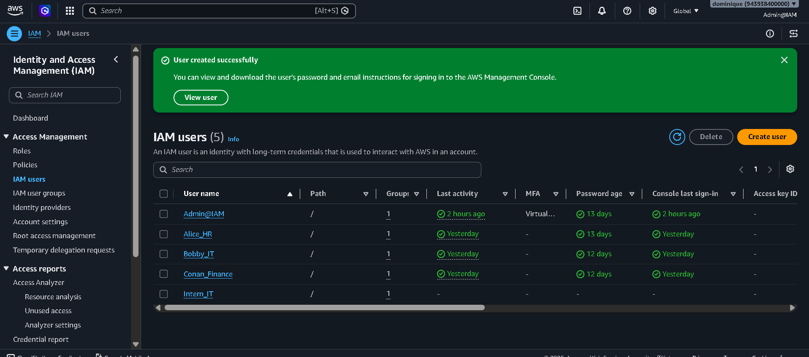

**SNS Email**

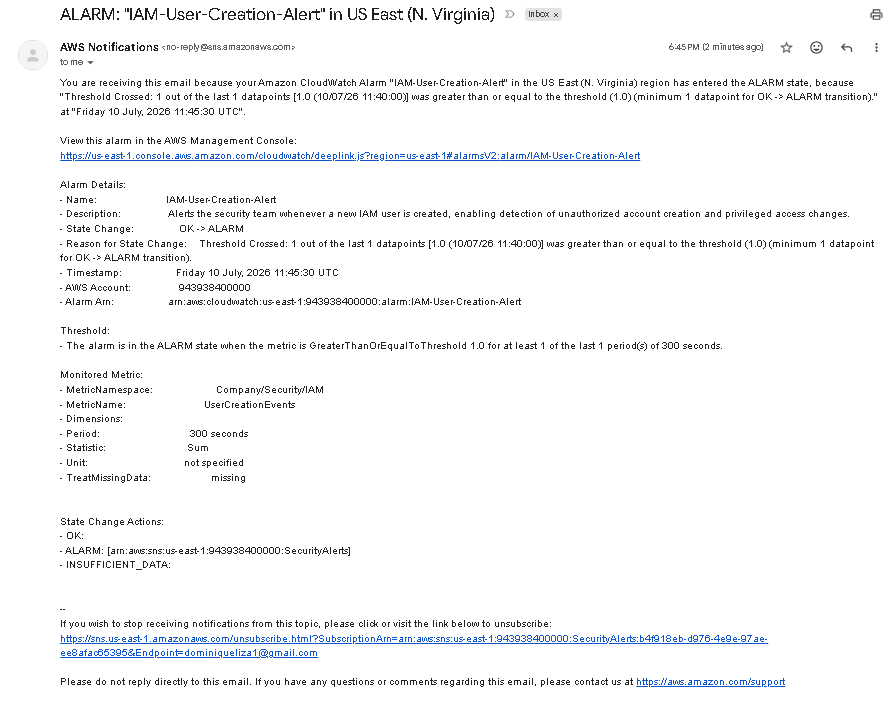

**CloudWatch Alarm Triggered**

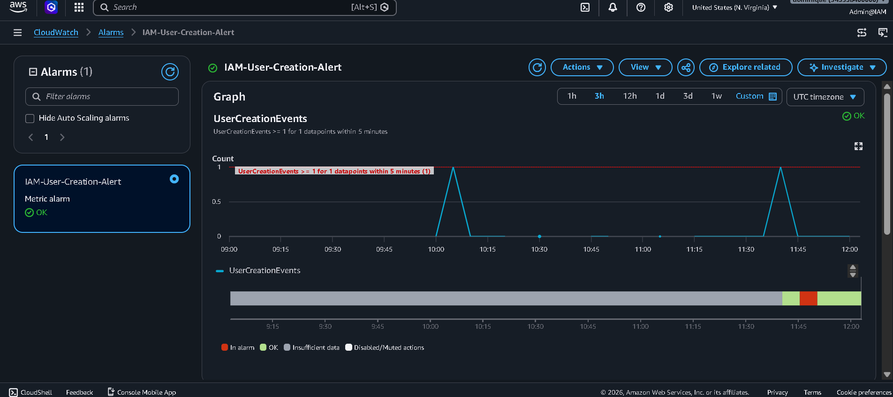

**Validation Result**

This validation confirmed that the end-to-end monitoring workflow operated successfully. IAM user creation events were recorded by AWS CloudTrail, processed by Amazon CloudWatch Logs, detected by the CloudWatch metric filter, triggered the CloudWatch alarm, and generated an automated email notification through Amazon SNS.

  ---

## 📊 4. Practical Execution & Findings

* **Key Activities Performed**

- Created an **AWS CloudTrail** trail to record management events across all AWS Regions.
- Configured an **Amazon S3** bucket to securely store CloudTrail log files.
- Enabled **Amazon CloudWatch Logs** integration for CloudTrail log delivery.
- Generated IAM management activities by:
  - Creating an IAM user (**Intern_HR**)
  - Adding **Intern_HR** to the **HR_Group**
  - Deleting **Intern_HR**, which automatically removed the user from **HR_Group** before deletion
- Performed IAM permission validation:
  - **Alice_HR** attempted to access **Amazon EC2** and received an **Access Denied** response. The unauthorized API call was recorded in AWS CloudTrail.
  - **Conan_Finance** successfully accessed **AWS Billing & Cost Management**, and the activity was recorded in AWS CloudTrail.
  - **Bobby_IT** successfully performed Amazon EC2 instance lifecycle operations by starting, stopping, and terminating an EC2 instance. Each action was recorded in AWS CloudTrail.
- Verified that CloudTrail management events were successfully delivered to **Amazon CloudWatch Logs**.
- Created a **CloudWatch Metric Filter** using the `CreateUser` filter pattern to detect IAM user creation events.
- Created a **CloudWatch Alarm** based on the **UserCreationEvents** metric.
- Configured an **Amazon SNS** topic to send email notifications when the CloudWatch alarm entered the **ALARM** state.
- Validated the complete monitoring pipeline by creating an **Intern_IT** IAM user, successfully triggering the CloudWatch alarm and receiving an Amazon SNS email notification.
    
* **Key Observations:**
  - AWS CloudTrail recorded both successful and failed API calls performed during this lab, providing an audit trail for security monitoring.
- Unauthorized API calls, such as **Alice_HR** attempting to access Amazon EC2, were recorded in CloudTrail with the `Client.UnauthorizedOperation` error code.
- IAM management activities, including `CreateUser`, `AddUserToGroup`, `RemoveUserFromGroup`, and `DeleteUser`, were successfully recorded in CloudTrail Event History.
- CloudTrail management events were successfully delivered to Amazon CloudWatch Logs, enabling the creation of monitoring rules and alerts.
- A CloudWatch Metric Filter using the `CreateUser` filter pattern successfully detected IAM user creation events.
- The configured CloudWatch Alarm and Amazon SNS notification successfully generated an email alert after the `CreateUser` event was detected.
- During testing, the JSON filter pattern `{$.eventName = "CreateUser"}` did not match the CloudTrail log format. Changing the filter pattern to `CreateUser` successfully detected the event.
- AWS automatically removed **Intern_HR** from **HR_Group** before deleting the IAM user, demonstrating that IAM group memberships must be removed before an IAM user can be deleted.
---

## 🚀 5. Key Takeaways & Career Alignment

* **Skill Demonstrated:**
  - AWS Identity and Access Management (IAM)
  - AWS CloudTrail
  - Amazon CloudWatch Logs
  - Amazon CloudWatch Metric Filters
  - Amazon CloudWatch Alarms
  - Amazon Simple Notification Service (SNS)
  - Role-Based Access Control (RBAC)
  - Principle of Least Privilege (PoLP)
  - Multi-Factor Authentication (MFA)
  - IAM Users and Groups
  - AWS Managed Policies
  - Permission Validation
  - Cloud Security Monitoring
  - Security Event Auditing
    
* **Next Steps:**
  - Implement custom IAM policies instead of AWS managed policies.
  - Monitor additional IAM events such as `DeleteUser`, `AttachUserPolicy`, and `CreateAccessKey`.
  - Configure metric filters for suspicious authentication and privilege escalation activities.
  - Integrate AWS GuardDuty and AWS Security Hub.
  - Forward CloudTrail logs to Splunk for centralized security monitoring and analysis.
    
## 🛠 Skills Practiced
  - Amazon Web Services (AWS)
  - AWS Identity and Access Management (IAM)
  - AWS CloudTrail
  - Amazon CloudWatch
  - Amazon Simple Notification Service (SNS)
  - Cloud Security Monitoring
  - Security Event Monitoring
  - IAM Permission Validation
  - Role-Based Access Control (RBAC)
  - Principle of Least Privilege (PoLP)
  - Multi-Factor Authentication (MFA)
  - Security Auditing
  - Incident Detection Fundamentals

### Career Alignment
 This project demonstrates practical experience in implementing an AWS security monitoring workflow using AWS Identity and Access Management (IAM), AWS CloudTrail, Amazon CloudWatch, and Amazon SNS.

By validating IAM permissions, monitoring management events, configuring automated alerts, and documenting the implementation, this project showcases practical cloud security skills relevant to entry-level roles such as:

- Junior Cloud Security Engineer
- SOC Analyst (L1)
- Cloud Security Analyst
- Cloud Support Associate
