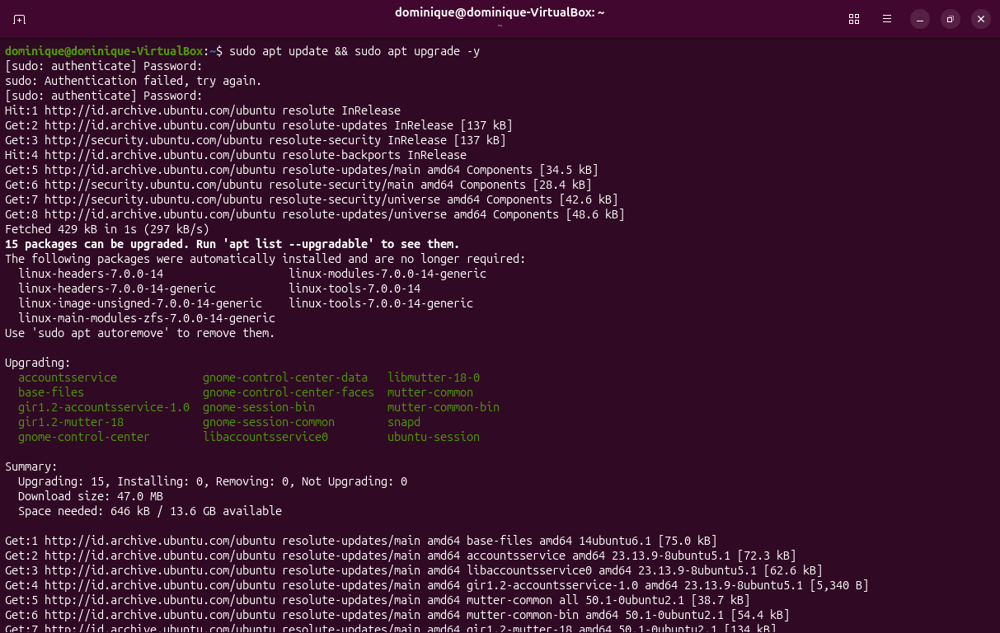
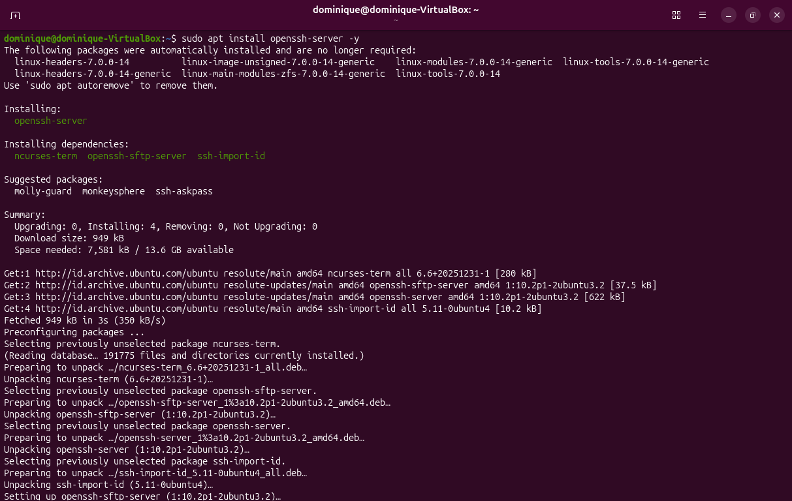
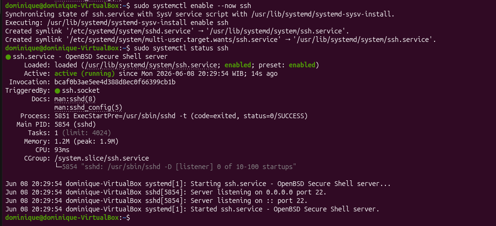
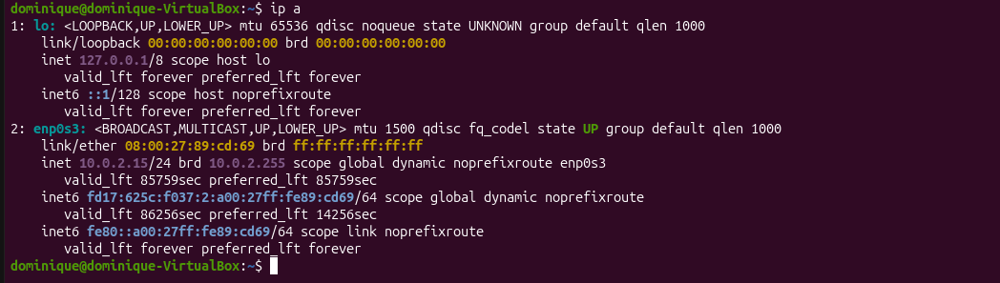
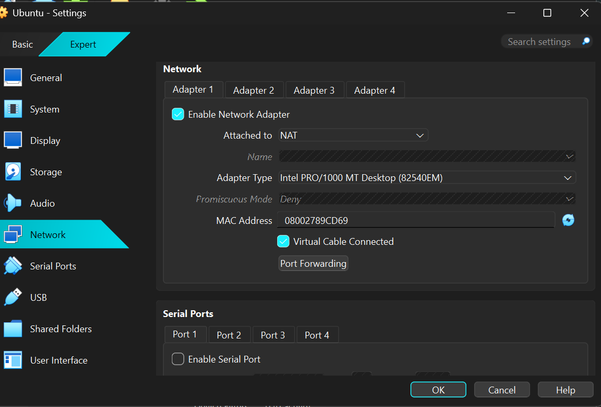
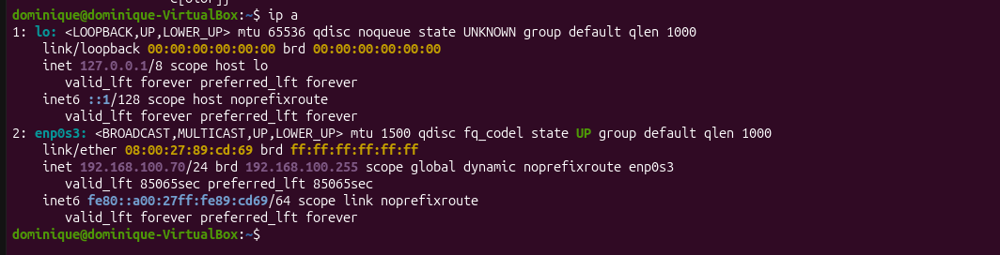
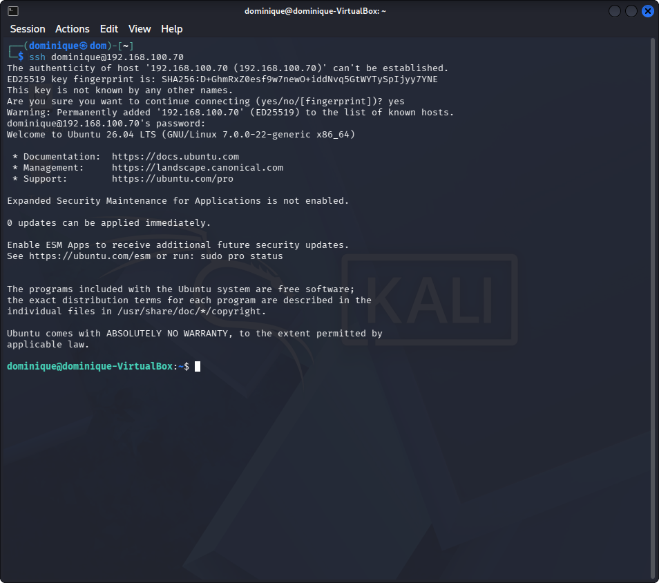
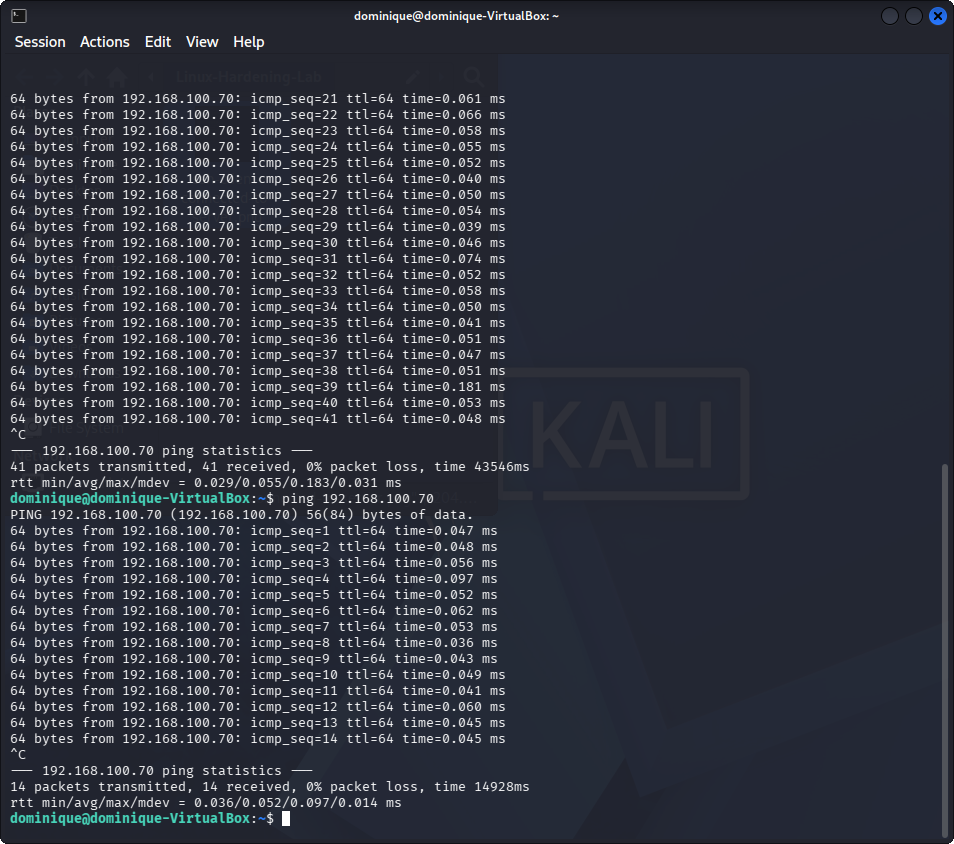
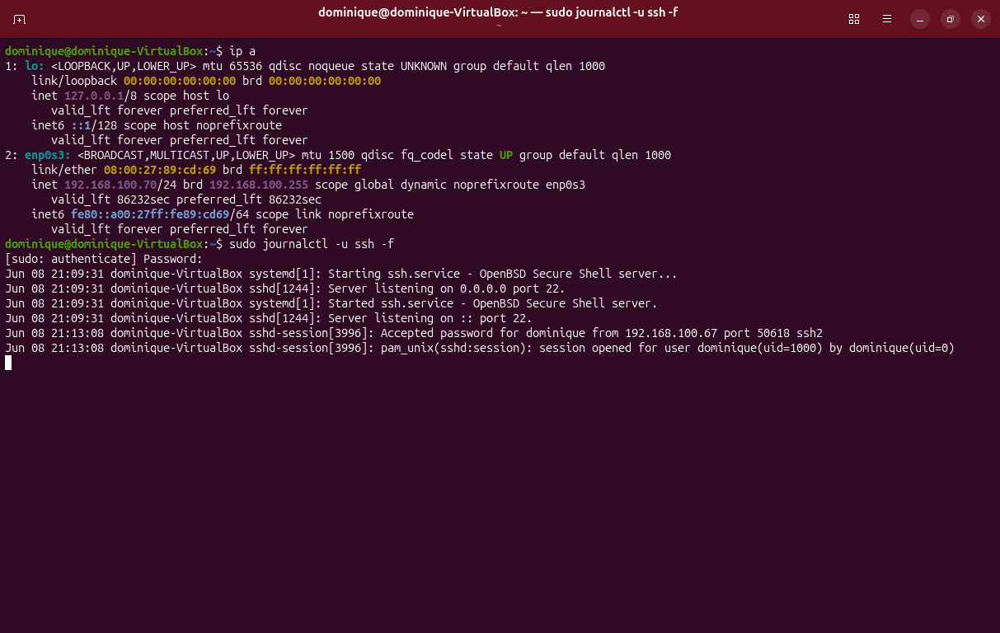
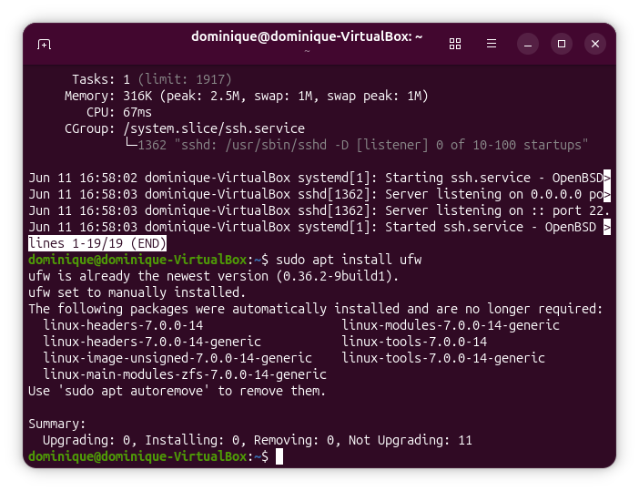

# LINUX HARDENING & SSH AUTHENTICATION MONITORING

## 📌 1. Project Objective
The objective of this lab was to learn beginner linux hardening concepts and monitor SSH authentication log using Ubuntu Server and Kali Linux inside a VirtualBox environment.

The lab focused on :
- configuring SSH remote access between Ubuntu Server and Kali Linux
- understanding the communication between client and server machines
- monitoring SSH authentication log activity
- observing live SSH authentication logs 
- building foundational Linux hardening knowledge with UFW and Fail2Banfor future SIEM and SOC analysis projects
---

## ⚙️ 2. Lab Specifications & Tools

* **Hypervisor / Platform:** Oracle VM VirtualBox 
* **Operating System(s):**
  - Kali Linux (Client Machine)
  - Ubuntu Server (Server Machine)
* **Security Tools Used:**
  - OpenSSH Server
  - Linux Terminal
  - Journalctl
  - UFW
  - Fail2Ban

### Hardware Resource Profiles:


| Component | Allocation | Purpose |
| :--- | :--- | :--- |
| **Memory (RAM)** | 2048 MB | Provide stable Ubuntu Server performance during SSH operations. |
| **Processors** | 2 vCPUs | Support virtualization and SSH service execution. |
| **Network Mode** | Bridged Adapter | allows direct communication between Kali Linux and Ubuntu Server |


---

## ⚠️ 3. Engineering Challenges & Troubleshooting

### Incident / Roadblock: 
Ubuntu Server installation initially failed to reboot correctly inside VirtualBox, while additional confusion occurred during SSH communication setup between Kali Linux and Ubuntu Server. 
* **The Problem:**
During Ubuntu Server installation process, the virtual machine displayed:
- restart button not responding properly
- "No bootable medium" errors after reboot attempts
This created uncertainty regarding whether Ubuntu Server had been installed successfully or whether the ISO image was still being prioritized during boot.

Additional confusion also occurred regarding:
- VirtualBox network configuration
- identifying the correct Ubuntu Server IP address
- understanding where SSH authentication logs were stored
- differentiating between client and server machine responsibilities

Another issue occurred because the Ubuntu installation ISO remained attached to the virtual optical drive after installation completion. As a result, VirtualBox continued attempting to boot from the installation media instead of the virtual hard disk.

Additionally, `/var/log/auth.log` was unavailable on the Ubuntu Server installation because the newer Ubuntu version used `journalctl` logging instead for monitoring live SSH authentication activity. 

During firewall configuration, SSH access initially failed after enabling UFW because SSH traffic had not yet been explicitly allowed through the firewall rules. This caused SSH connection attempts from the Kali Linux client machine to be refused on port 22.


* **The Resolution Workflow:** 
  1. Installed Ubuntu Server inside VirtualBox.
  2. updated and upgraded application on Ubuntu Server packages using:
     ```bash
     sudo apt update && sudo apt upgrade -y
     ```
     
         
  3. installed openSSH Server using :
      ```bash
      sudo apt install openssh-server -y
      ```
     
     
  4. checked the SSH service status using:
      ```bash
      sudo systemctl status ssh
      ```
     
     
    the SSH service status initially showed:
     `inactive (dead)`
  
    to automatically start and enable the SSH service during boot, the following command we used:
     ``` bash
     sudo systemctl enable --now ssh
     ``` 
     
     
    the SSH service status successfully changed to:
    `active (running)`
   
  5. Requested the Ubuntu Server IP address using:
     ``` bash
     ip a
     ```
     initially, the Ubuntu Server machine was still using NAT network mode.
     
     
     
  6. Change the VirtualBox network configuration for the Ubuntu Server from:
     `NAT to Bridged Adapter`

     
           
  
  7. Requested the Ubuntu Server IP address again using:
      ``` bash
      ip a
      ```    
    
       
  8. open the Kali Linux virtual machine and connected remotely to Ubuntu Server using SSH:
    ``` bash
    ssh username@ipaddress
    ``` 
    
        
  9. Verified network communication between Kali Linux and Ubuntu server using:
     ```bash
     ping ubuntu_server_ip
     ```     
    
    
    Successful replies confirmed that the client machine could communicate correctly with the Ubuntu Server machine.

  10. monitored live SSH authentication logs on Ubuntu using:
      ```bash
      sudo journalctl -u ssh -f 
      ```
      
      
    this allowed live observation of SSH authentication activity generated from the client machine.
  11. installed firewall with UFW :
      ```bash
      sudo apt install ufw
      ```
      

  12. checked UFW status using :
      ```bash 
      sudo ufw status
      ```
      
     Initially UFW status showed:
     `inactive`
  13. During firewall configuration, SSH connectivity unexpectedly stopped after enabling UFW.
    SSH connection attempts from Kali Linux client machine became unavailable because SSH traffic had not yet been             explicity allowed through firewall rules yet.
  
    To resolve the issue:
   SSH traffic was allowed through UFW and the firewall configuration was verified.
      ```bash
      sudo ufw allow ssh
      sudo ufw enable
      sudo ufw status verbose
      ```
    
    After updating firewall rules, SSH connectivity between Kali Linux and Ubuntu Server was restored successfully
    
  14. installed Fail2Ban using :
      ```bash
      sudo apt install fail2ban -y
      ```
    
    
  15. check the status of Fail2Ban using :
      ```bash
      sudo systemctl status fail2ban
      ```
      the Fail2Ban service status on SSH initially showed:
     `active(Running)`
    
---

## 📊 4. Practical Execution & Findings

* **Activity Executed:**
  - installed openSSH-server on Ubuntu Server
  - checked the status of SSH service and enable the systemm with `sudo systemctl status ssh` `sudo systemctl enable --now ssh`
  - requested Ubuntu Server IP Address using `ip a`
  - Connected the Kali Linux client machine to Ubuntu Server using:
    `ssh username@ipaddress_ubuntu_server`
  - Verified network communication between the client machine and server machine using:
    `ping ip_ubuntu_server`
  - Monitored and observed live SSH authentication activity generated from the client machine using:
    `sudo journalctl -u ssh -f`
  - installed UFW and configuration firewall with `sudo ufw allow ssh` `sudo ufw enable`
  - checked the status of UFW with `sudo ufw status verbose`
  - installed Fail2Ban and check status of Fail2Ban service with `sudo systemctl status fail2ban`
* **Key Observations:**
  - SSH successfully enabled encrypted remote communication between Kali Linux and Ubuntu Server.
  - The Ubuntu Server machine recorded SSH authentication activity generated from the client machine.
  - SSH authentication logs displayed:
      - successful login events
      - session opened events
      - session closed events
  - `journalctl` was used to monitor live SSH authentication activity because `/var/log/auth.log` was unavailable on the Ubuntu Server installation.
  - Bridged Adapter networking allowed direct communication between the Kali Linux client machine and Ubuntu Server.
  - SSH services must be actively running before remote client connections can be established successfully.
  - UFW  restricted network access and required explicit SSH allow rules before remote connectivity could established.
  - Improper firewall configuration can unintentionally block legitimate administration access.
  - Fail2Ban was successfully deployed and actively monitored SSH authentication activity.
  - Fail2Ban automatically provides protection against repeated authentication faileures by temporarily banning offending IP addresses.
  - UFW and Fail2Ban provided complementary security controls by restricting unauthorized access and protecting SSH services from repeated authentication failures.
---

## 🚀 5. Key Takeaways & Career Alignment
* **Conclusion:**
  This lab successfully established a secure SSH communication environment between Kali Linux and Ubuntu Server while introducing foundational Linux hardening concepts through OpenSSH, UFW, and Fail2Ban. The project also demonstrated authentication monitoring using journalctl and provided practical experience with troubleshooting network, service, and firewall-related issues.
* **L1 SOC Skill Demonstrated:**
  - Basic Linux hardening
  - SSH remote access configuration
  - Host-based firewall configuration using UFW
  - Basic intrusion prevention using Fail2Ban
  - SSH authentication monitoring
  - Linux service management using systemctl
  - Authentication log monitoring using journalctl
  - VirtualBox network troubleshooting
  - Client and server communication understanding
  - Basic Linux networking and connectivity verification
* **Next Steps:**
  - Continue building beginner SOC and Linux security projects
  - Perform SSH failed-login investigations
  - Analyze authentication logs generated from successful and failed login attempts
  - Forward authentication logs into Splunk for centralized monitoring
## 🛠 Skills Practiced
  - VirtualBox networking configuration
  - Ubuntu Server administration
  - Kali Linux client usage
  - OpenSSH Server installation and configuration
  - Linux terminal usage
  - SSH remote connectivity
  - Linux service management
  - Authentication log monitoring
  - Network communication troubleshooting
  - Technical documentation and reporting
