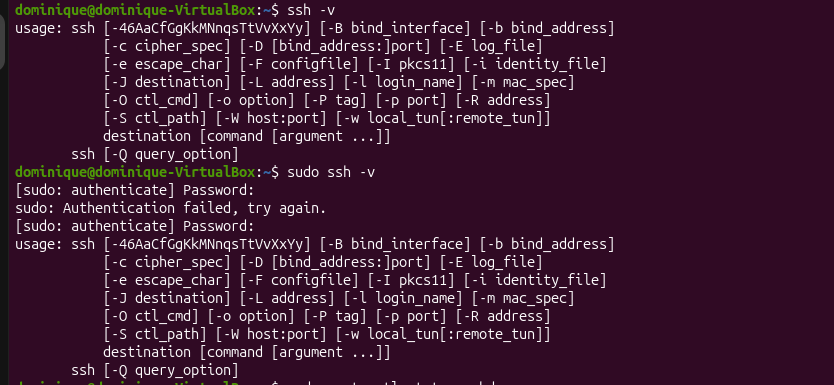

# LINUX HARDENING & SSH AUTHENTICATION MONITORING

## 📌 1. Project Objective
The objective of this lab was to learn beginner linux hardening concepts and monitor SSH authentication log using Ubuntu Server and Kali Linux inside a VirtualBox environment.

The lab focused on :
- configuring SSH remote access between Ubuntu Server and Kali Linux
- understanding the communication between client and server machines
- monitoring SSH authentication log activity
- observing live SSH authentication logs 
- building foundational Linux hardening knowledge for future SIEM and SOC analysis projects
---

## ⚙️ 2. Lab Specifications & Tools

* **Hypervisor / Platform:** Oracle VM VirtualBox 
* **Operating System(s):**
  - Kali Linux (Client Macchine)
  - Ubuntu Server (Server Machine)
* **Security Tools Used:**
  - OpenSSH Server
  - Linux Terminal
  - Journalctl

### Hardware Resource Profiles:


| Component | Allocation | Purpose |
| :--- | :--- | :--- |
| **Memory (RAM)** | 2048 MB | Provide stable Ubuntu Server performance during SSH operations. |
| **Processors** | 2 vCPUs | Support virtualization and SSH service execution. |
| **Network Mode** | Bridged Adapter | allows direct communication between Kali Linux and Ubuntu Server |


---

## ⚠️ 3. Engineering Challenges & Troubleshooting

### Incident / Roadblock: 
Ubuntu Server installation initially failed to reboot correctly inside VirtualBox, while additional confusion occurred during SSH communication setup between Kali Linux and Ubuntu Server.

* **The Problem:**
During Ubuntu Server installation process, the virtual machine displayed:
- restart button not responding properly
- "No bootable medium" errors after reboot attempts
This created uncertainty regarding whether Ubuntu Server had been installed successfully or whether the ISO image was still being prioritized during boot.

Additional confusion also occurred regarding:
- VirtualBox network configuration
- identifying the correct Ubuntu Server IP address
- understanding where SSH authentication logs were stored
- differentiating between client and server machine responsibilities

Another issue occurred because the Ubuntu installation ISO remained attached to the virtual optical drive after installation completion. As a result, VirtualBox continued attempting to boot from the installation media instead of the virtual hard disk.

Additionally, `/var/log/auth.log` was unavailable on the Ubuntu Server installation because the newer Ubuntu version used `journalctl` logging instead for monitoring live SSH authentication activity.  


* **The Resolution Workflow:** 
  1. Installed Ubuntu Server inside VirtualBox.
  2. updated and upgraded application on Ubuntu Server packages using:
     ```bash
     sudo apt update && sudo apt upgrade -y
     ```
     
     
  3. Checked whether SSH was already installed on Ubuntu Server using:
     ```bash
      ssh -V
     ```
     
     
  4. installed openSSH Server using :
      ```bash
      sudo apt install openssh-server -y
      ```
     
     
  5. checked the SSH service status using:
      ```bash
      sudo systemctl status ssh
      ```
     
     
    the SSH serrvice status initially showed:
     `inactive (dead)`
  
    to automatically start and enable the SSH service during boot, the following command we used:
     ``` bash
     sudo systemctl enable --now ssh
     ``` 
     
     
    the SSH service status successfully changed to:
    `active (running)`
   
  6. Requsted the Ubuntu Server IP address using:
     ``` bash
     ip a
     ```
     initially, the Ubuntu Server machine was still using NAT network mode.
     
     
     
  7. Change the VirtualBox network configuration for the Ubuntu Server from:
     `NAT to Bridged Adapter`

     
           
  
  8. Requested the Ubuntu Sever IP address again using:
      ``` bash
      ip a
      ```    
    
       
  8. open the Kali Linux virtual machine and connected remotely to Ubuntu Server using SSH:
    ``` bash
    sudo username@ipaddress
    ``` 
    
        
  9. Verified network communication between Kali Linux and Ubuntu server using:
     ```bash
     ping ubuntu_server_ip
     ```     
    
    
    Successful replied confirmed that the client machine could communicate correctly with the Ubuntu Server machine.

  10. monitored live SSH authentication logs on Ubuntu using:
      ```bash
      sudo journalctl -u ssh -f 
      ```
      
      
    this allowed live observation of SSH authentication activity generated from the client machine.
---

## 📊 4. Practical Execution & Findings

* **Activity Executed:**
  - install openSSH-server on Ubuntu Server
  - checked the status of SSH service and enable the systemm with `systemctl status ssh` `systemctl enable --now ssh`
  - requested Ubuntu Server IP Address using `ip a`
  - Connected the Kali Linux client machine to Ubuntu Server using:
    `ssh username@ipaddress_ubuntu_server`
  - Verified network communication between the client machine and server machine using:
    `ping ip_ubuntu_server`
  - Monitored and observed live SSH authentication activity generated from the client machine using:
    `sudo journalctl -u ssh -f`
* **Key Observations:**
  - SSH successfully enabled encrypted remote communication between Kali Linux and Ubuntu Server.
  - The Ubuntu Server machine recorded SSH authentication activity generated from the client machine.
  - SSH authentication logs displayed:
      - successful login events
      - session opened events
      - session closed events
  - `journalctl` was used to monitor live SSH authentication activity because `/var/log/auth.log` was unavailable on the Ubuntu Server installation.
  - Bridged Adapter networking allowed direct communication between the Kali Linux client machine and Ubuntu Server.
  - SSH services must be actively running before remote client connections can be established successfully.
---

## 🚀 5. Key Takeaways & Career Alignment
* **L1 SOC Skill Demonstrated:**
  - Basic Linux hardening
  - SSH remote access configuration
  - SSH authentication monitoring
  - Linux service management using systemctl
  - Authentication log monitoring using journalctl
  - VirtualBox network troubleshooting
  - Client and server communication understanding
  - Basic Linux networking and connectivity verification
* **Next Steps:**
  - Continue building beginner SOC and Linux security projects
  - Install and configure UFW firewall
  - Install and configure Fail2Ban
  - Generate failed SSH login attempts
  - Investigate authentication logs further
  - Integrate authentication logs into Splunk later
## 🛠 Skills Practiced
  - VirtualBox networking configuration
  - Ubuntu Server administration
  - Kali Linux client usage
  - OpenSSH Server installation and configuration
  - Linux terminal usage
  - SSH remote connectivity
  - Linux service management
  - Authentication log monitoring
  - Network communication troubleshooting
  - Technical documentation and reporting
