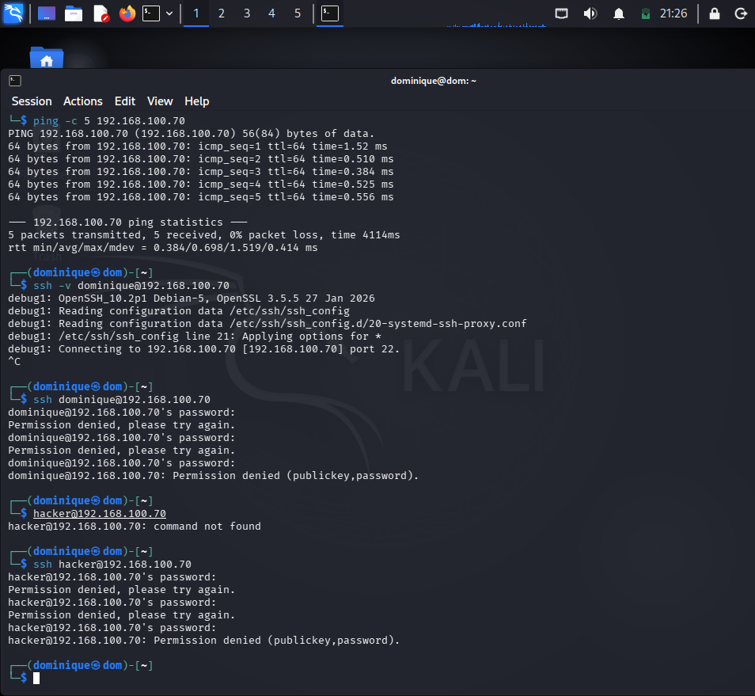
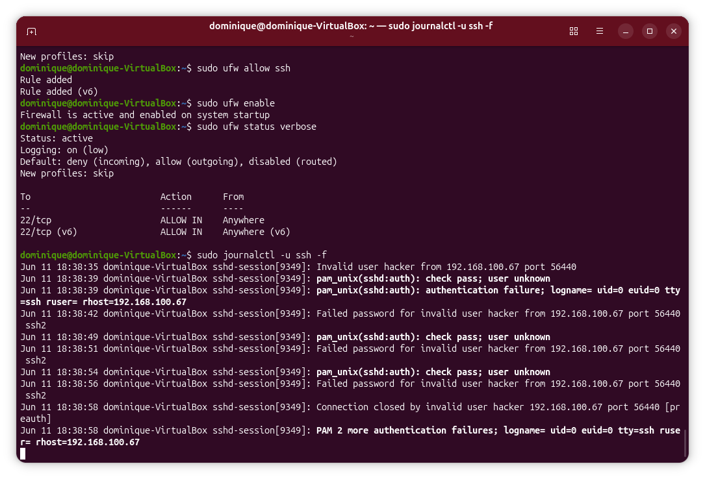
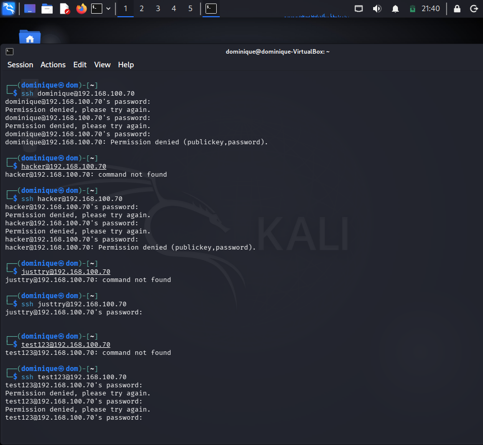
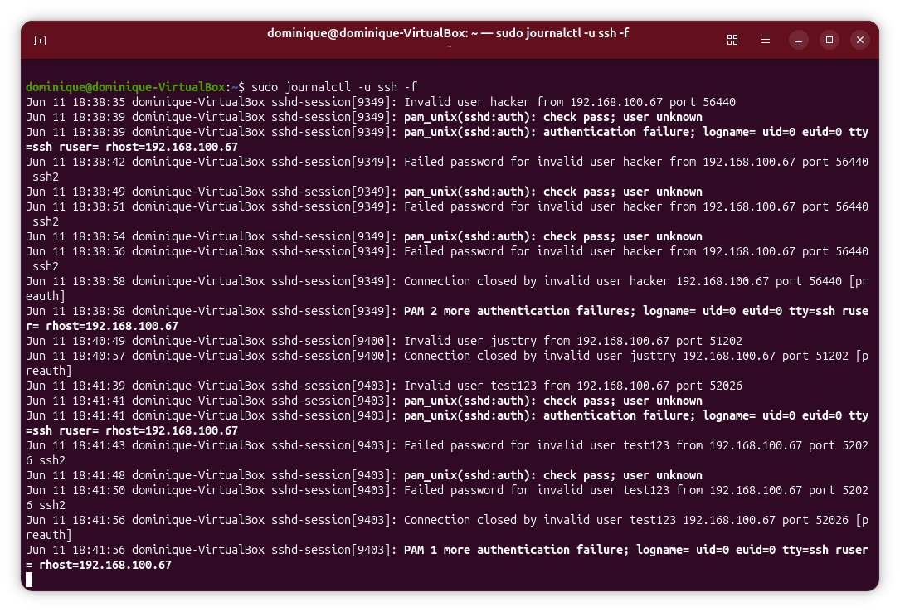
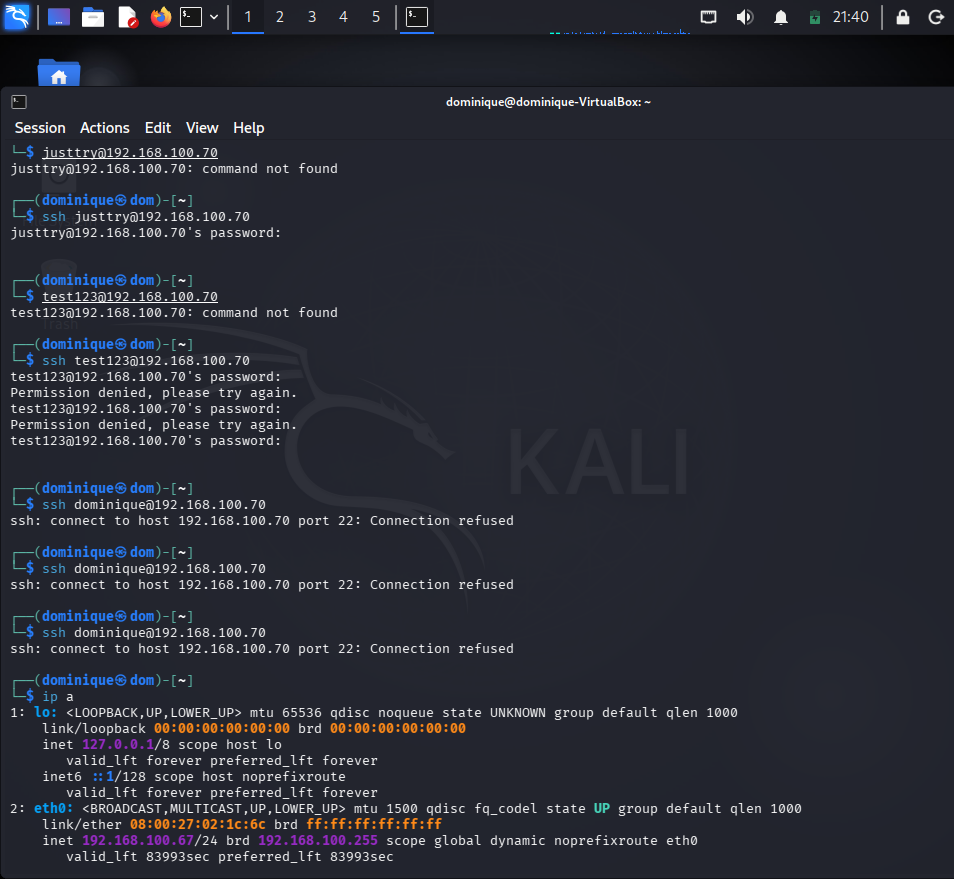
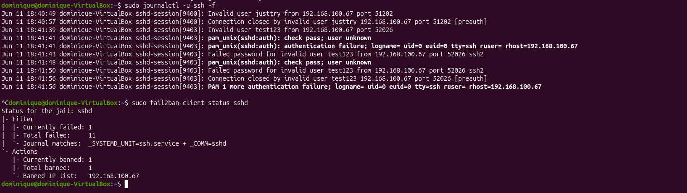
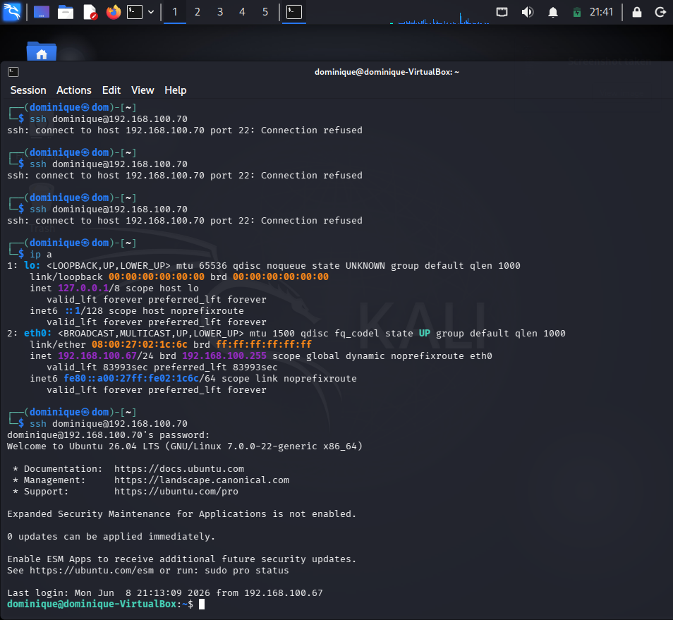

# SSH FAILED LOGIN INVESTIGATION

## 📌 1. Project Objective
The objective of this lab was to investigate failed SSH authentication attempts and analyze authentication logs generated on Ubuntu Server using Kali Linux inside a VirtualBox environment.

The lab focused on :
- understanding the communication between client and server machines
- generating successful and failed SSH authentication attempts
- monitoring SSH authentication activity using `journalctl`
- identifying authentication failures caused by invalid usernames and incorrect passwords
- observing Fail2Ban detection and automatic IP banning behavior
- building foundational log analysis and incident investigation skills for future SIEM and SOC analysis projects
---

## ⚙️ 2. Lab Specifications & Tools

* **Hypervisor / Platform:** Oracle VM VirtualBox 
* **Operating System(s):**
  - Kali Linux (Client Machine)
  - Ubuntu Server (Server Machine)
* **Security Tools Used:**
  - OpenSSH Server
  - Linux Terminal
  - `journalctl`
  - UFW
  - Fail2Ban

### Hardware Resource Profiles:


| Component | Allocation | Purpose |
| :--- | :--- | :--- |
| **Memory (RAM)** | 2048 MB | Provide stable Ubuntu Server performance during SSH operations and log monitoring. |
| **Processors** | 2 vCPUs | Support virtualization,authentication logging, and security monitoring services. |
| **Network Mode** | Bridged Adapter | allows direct communication between Kali Linux and Ubuntu Server for SSH authentication testing |


---

## ⚠️ 3. Engineering Challenges & Troubleshooting

### Incident / Roadblock: 
Generating and analyzing failed SSH authentication attempts while distinguishing between invalid username activity, incorrect password attempts, and Fail2Ban enforcement actions.

* **The Problem:**
During the investigation, multiple failed SSH login attempts were intentionally generated from the Kali Linux client machine using both:
- valid usernames with incorrect passwords
- invalid usernames with incorrect passwords

Although the login attempts were successfully rejected by Ubuntu Server, it was initially unclear:
- how failed authentication events would appear in the SSH logs
- whether log entries would differ between invalid usernames and incorrect passwords
- how Fail2Ban would respond after repeated authentication failures
- how to verify that an IP address had been automatically banned

Additional investigation was required to correlate authentication events observed from the client machine with the corresponding log entries generated on the Ubuntu Server.

As repeated failed login attempts continued, Fail2Ban automatically detected suspicious authentication activity and temporarily banned the Kali Linux client IP address, preventing further SSH connections until the IP address was manually unbanned.

* **The Resolution Workflow:** 
  1. Started both Ubuntu Server and Kali Linux virtual machines.
  2. Updated Kali Linux packages using:
     ```bash
     sudo apt update && sudo apt upgrade -y
     ```
  3. Verified connectivity between Kali Linux and Ubuntu Server.         
  4. Initiated an SSH connection from Kali Linux to Ubuntu Server using:
     ``` bash
     ssh username@ipaddress
     ``` 
  5. Generated failed authentication attempts by using a valid username with an incorrect password.
     ```bash
     ssh dominique@192.168.100.70
     ```
     
      
     After entering an incorrect password multiple times, Ubuntu Server rejected the authentication request and returned:

     Permission denied (publickey,password)
  
  6. Monitored SSH authentication logs on Ubuntu Server using:
     ```bash
     sudo journalctl -u ssh -f
     ```
      
     
    This allowed live observation of authentication events generated by the client machine, including failed login attempts caused by incorrect passwords.
   
  7. Generated failed authentication attempts by using a invalid username with an incorrect password.
      ```bash
      ssh hacker@192.168.100.70
      ssh justtry@192.168.100.70
      ssh test123@192.168.100.70 
      ```
      

    After entering an incorrect password multiple times, Ubuntu Server rejected the authentication request and returned:

    Permission denied (publickey,password)
  
  8. monitored live SSH authentication logs on Ubuntu Server using:
      ```bash
      sudo journalctl -u ssh -f 
      ```
      
      
    This allowed live observation of SSH authentication activity generated from the client machine.
         
  9. Attempted Authentication using a valid username and password after multiple failed login attempts:
      ```bash
      ssh dominique@192.168.100.70
      ```
      

   Ubuntu Server rejected the connection request and returned:
  
    `ssh: connect to host 192.168.100.70 port 22: Connection refused`
  
  This indicated that the client machine had likely been banned by Fail2Ban after exceeding the failed authentication threshold.
            
  10. Verified the Fail2Ban status on Ubuntu Server using:
     ```bash
     sudo fail2ban-client status sshd
     ```     
    
    
   The output confirmed that the Kali Linux IP address had been added to the banned IP list.

  11. Removed the Kali Linux IP address from the Fail2Ban list using:
     ```bash
     sudo fail2ban-client unbanip 192.168.100.67
     sudo fail2ban-client status sshd
     ``` 
    
   
  12. Attempted authentication again using a valid username and password:
      ```bash
      ssh dominique@192.168.100.70
      ```
      
      The Kali Linux client machine successfully established an SSH connection to Ubuntu Server after the IP address was unbanned.
      

---

## 📊 4. Practical Execution & Findings

* **Activity Executed:**
  - generated failed SSH login attempts using a valid username with incorrect passwords.
  - generated failed SSH login attempts using an invalid usernames with incorrect passwords.
  - Monitored live SSH authentication activity generated from the client machine using:
    `sudo journalctl -u ssh -f`
  - compared log entries generated by valid-user authentication failures and invalid-user authentication failures
  - triggered Fail2Ban protection through repeated failed login attempts
  - verified the banned IP address using `sudo fail2ban-client status sshd`
  - removed the banned IP address on the Fail2Ban IP banned list using `sudo fail2ban-client unbanip client_ip_address`
  - confirmed successful SSH authentication after the IP address removed from fail2Ban ban list.
* **Key Observations:**
  - Ubuntu Server recorded all failed SSH authentication attempts in the system logs with `journalctl`
  - failed login attempts using a valid username generated "Failed password" entries
  - Failed login attempts using invalid usernames generated authentication failure events associated with unknown users.
  - Repeated authentication failures triggered Fail2Ban protection mechanisms.
  - Fail2Ban automatically added the Kali Linux client IP address to the banned IP list after multiple failed authentication attempts.
  - Once the IP address was banned, SSH connectivity to Ubuntu Server was no longer possible from the client machine.
  - The Fail2Ban status output provided visibility into active bans and offending IP addresses.
  - Removing the banned IP address immediately restored SSH connectivity.
  - Authentication logs provided valuable information for identifying suspicious login activity and potential brute-force attacks.
  - Combining authentication log monitoring with Fail2Ban created a basic host-based detection and response capability.
---

## 🚀 5. Key Takeaways & Career Alignment
* **Conclusion:**
 This lab demonstrated how failed SSH authentication attempts are recorded, monitored, and investigated on Ubuntu Server. By generating both invalid username and incorrect password scenarios, the project provided practical experience analyzing authentication logs and understanding how Fail2Ban automatically responds to suspicious login activity. The investigation also highlighted the importance of log monitoring for identifying potential brute-force attacks and unauthorized access attempts.
* **L1 SOC Skill Demonstrated:**
  - Authentication log analysis
  - SSH security monitoring
  - Failed login investigation
  - Log correlation and event analysis
  - Host-based intrusion prevention using Fail2Ban
  - Linux service administration
  - Incident validation and troubleshooting
  - Security event monitoring
  - Basic threat detection concepts
* **Next Steps:**
  - Forward authentication logs into Splunk for centralized monitoring
  - Create dashboard for failed login activity
  - Build alerts for excessive authentication failures
  - Investigate brute-force attack patterns using centralized logging
  - Expand monitoring to additional Linux services
## 🛠 Skills Practiced
 - SSH authentication analysis
 - Authentication log monitoring
 - Linux log investigation
 - Fail2Ban administration
 - IP ban verification and remediation
 - Security event analysis
 - Linux command-line operations
 - Incident troubleshooting
 - Technical documentation and reporting

