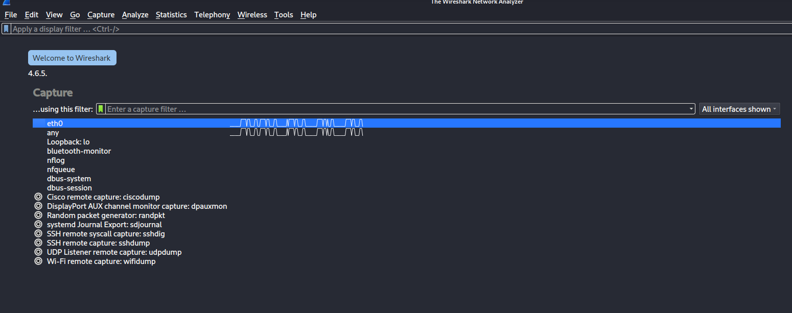
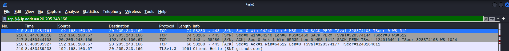
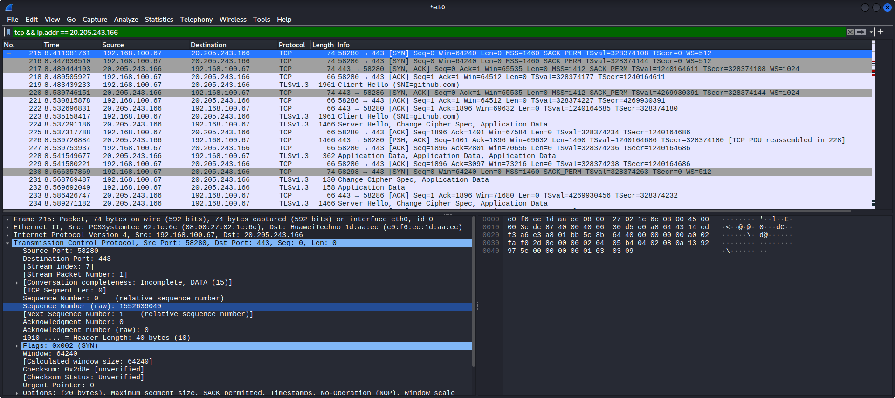
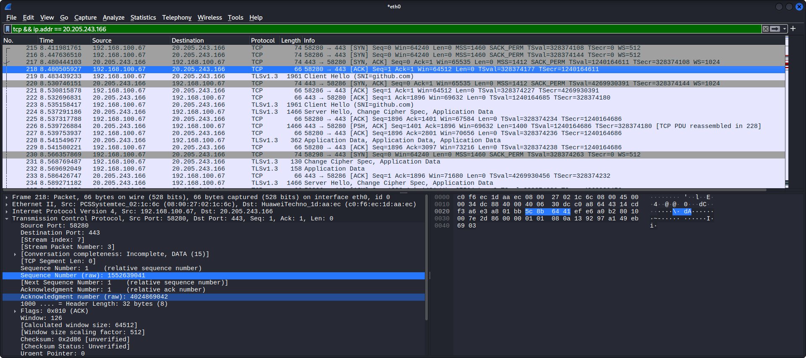

# TCP 3-Way Handshake Analysis with Wireshark

## 📌 1. Project Objective
The objective of this lab was to learn TCP 3 Way Handshake practically using Wireshark in Kali linux Virtual Machine environment

The lab focused on:
- capturing live TCP 3-way handshake traffic
- analyzing SYN, SYN-ACK, and ACK packets generated from github.com
- documenting TCP 3-Way Handshake behavior using raw sequence numbers and acknowledgement numbers

---

## ⚙️ 2. Lab Specifications & Tools

* **Hypervisor / Platform:** Oracle VM VirtualBox 
* **Operating System(s):** Kali Linux
* **Security Tools Used:** Wireshark

### Hardware Resource Profiles:


| Component | Allocation | Purpose |
| :--- | :--- | :--- |
| **Memory (RAM)** | 4096 MB | Prevents application lag and data drops during active packet capture processing. |
| **Processors** | 2 vCPUs | Required for smooth real-time multi-threaded packet dissection and interface rendering. |
| **Network Mode** | Bridged Adapter | Allows the virtual machine to bypass NAT restrictions and sniff live local network interfaces. |


---

## ⚠️ 3. Engineering Challenges & Troubleshooting

### Incident / Roadblock: 
Ensuring TCP traffic visibility and identifying TCP SYN, SYN-ACK, and ACK packets correctly inside Wireshark.

* **The Problem:**
During live packet capture, Wireshark displayed multiple network protocols simultaneously, making it difficult to isolate TCP handshake-related traffic clearly. Additional filtering and packet inspection were required to identify TCP handshake communication generated from the `tcp && ip.addr==20.205.243.166` requests and to verify successful 3 way handshake of TCP.

* **The Resolution Workflow:** 
  1. Open VirtualBox and Start Kali Linux.
  2. Relaunch Wireshark using:
  ```bash
  wireshark &
     ```
  3. Confirmed that the `eth0` interface appeared correctly and verified that live network traffic could be captured successfully.

     
     
  4. Opened github.com using Mozilla Firefox for TCP 3 way handshake
       
     to generate and capture live network traffic using Wireshark
     
  5. Applied the `tcp && ip.addr==20.205.243.166` display filter in Wireshark to verify that Wireshark successfully captured the TCP 3 way handshake traffic generated from TCP traffic associated with the github.com IP address.
      
  

  6. Checked the TCP SYN request of github.com by client with port 58280 to server with port 443 successfully by check on sequence number(raw) = 1552639040
  

  7. Check on the response of github.com as server with port 443 to client with port 58280 successfully responded by sending an acknowledgement and requested synchronization with the client by new sequence number = 4024869041 and acknowledgement number (raw) = 1552639041

  

  8. Check on the response of client with port 58280 to github.com as server with port 443 successfully sending an acknowledgement to server by sequence number = 1552639041 and new acknowledgement number (raw) = 4024869042

  
  9.Exported the packet capture file generated during tcp-3-way-handshake for future investigation and traffic-review practice

  10. The packet capture file was saved as:
  tcp-3-way-handshake.pcapng
  and store inside the `pcaps/` directory
  

---

## 📊 4. Practical Execution & Findings

* **Activity Executed:**
  - captured live network traffic generated from github.com
  - use `nslookup` to find ip address of github.com 
  - Applied `tcp && ip.addr == 20.205.243.166` on display filter of Wireshark to isolate TCP 3 Way Handshake of github.com.

* **Key Observations:**
  - Wireshark successfully captured SYN, SYN-ACK, ACK packets generated from the website.
  - The packet capture confirmed successful TCP synchronization and acknowledgement process of the Kali Linux virtual machine as client and external web servers.
  - The `tcp && ip.addr == 20.205.243.166` filter helped simplify TCP SYN, SYN-ACK, AND ACK packet analysis by isolating only TCP and Ip Address-related traffic.
  - Packet timestamps, sequence numbers, acknowledgement numbers, and TCP connection behavior became visible during live traffic analysis.
---

## 🚀 5. Key Takeaways & Career Alignment
* **L1 SOC Skill Demonstrated:**
  - Basic packet capture and traffic analysis
  - Understanding of connection behavior by TCP 3-way handshake
  - Network interface troubleshooting
  - Beginner-level wireshark filtering and packet inspection 
* **Next Steps:**
  - Compare HTTP and HTTPS traffic visibility
  - Continue building beginner SOC and network-analysis projects
## 🛠 Skills Practiced
  - VirtualBox networking
  - Basic Networking Troubleshooting
  - Packet Capture
  - TCP 3-Way Handshake Analysis
  - Wireshark Filtering
  - Export `.pcap` files for future log-analysis practice
  - Documentation and Technical Reporting
