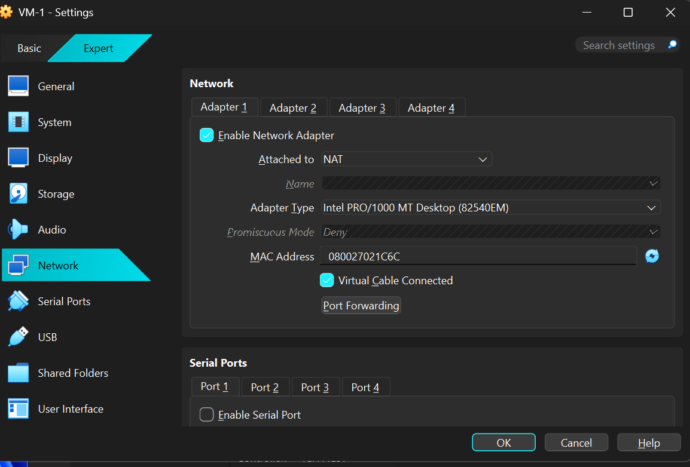
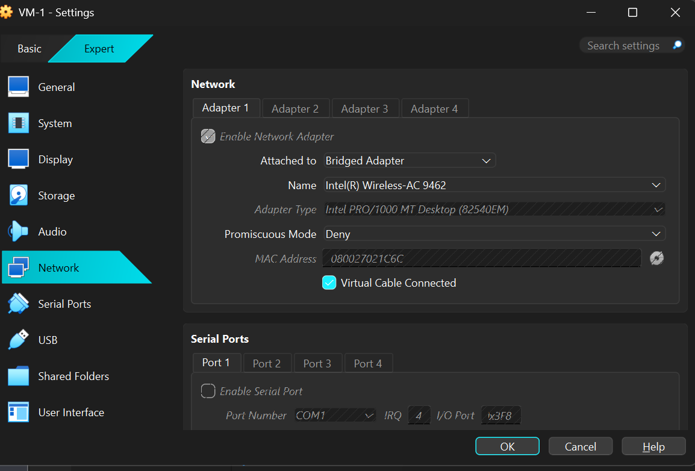
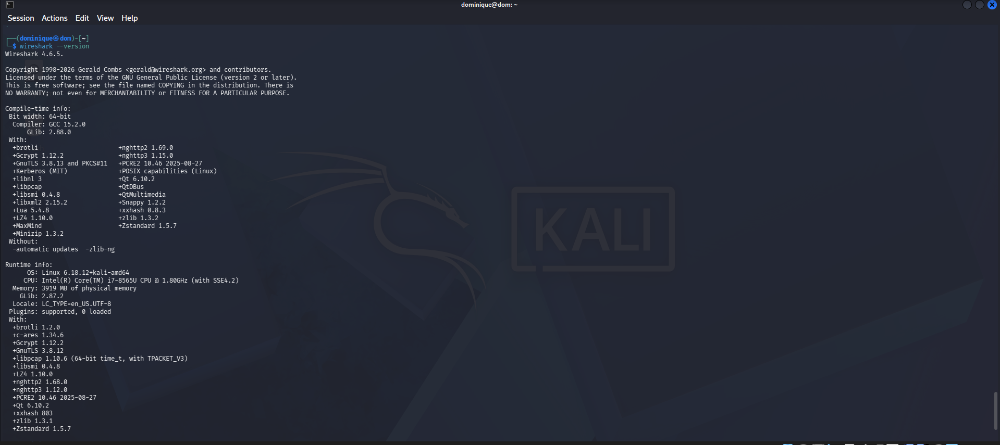
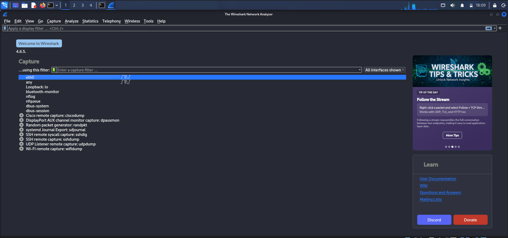
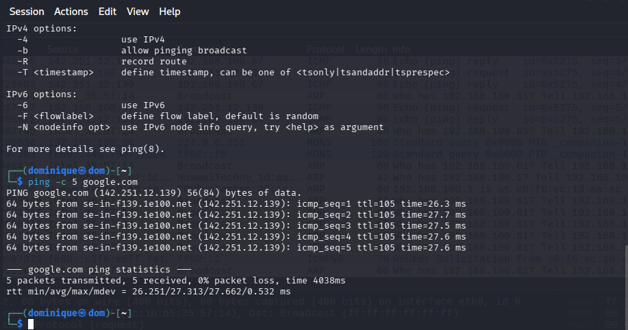
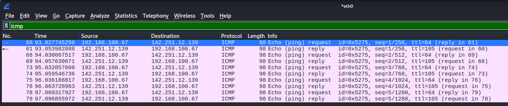

# SOC-Home-Lab
# Network Traffic Analysis & Packet Sniffing with Wireshark

## 📌 1. Project Objective
The objective of this lab was to learn fundamentals of network traffic analysis using Wireshark in Kali linux Virtual Machine environment

The lab focused on:
- installed Wireshark on VirtualBox
- configuring Wireshark correctly on VirtualBox
- understanding NAT vs Bridged Adapter networking for network traffic analysis
- capturing live network traffic
- analyzing ICMP packets generated from ping requests
- documenting troubleshooting and packet-capture workflow

---

## ⚙️ 2. Lab Specifications & Tools

* **Hypervisor / Platform:** Oracle VM VirtualBox 
* **Operating System(s):** Kali Linux
* **Security Tools Used:** Wireshark

### Hardware Resource Profiles:


| Component | Allocation | Purpose |
| :--- | :--- | :--- |
| **Memory (RAM)** | 4096 MB | Prevents application lag and data drops during active packet capture processing. |
| **Processors** | 2 vCPUs | Required for smooth real-time multi-threaded packet dissection and interface rendering. |
| **Network Mode** | Bridged Adapter | Allows the virtual machine to bypass NAT restrictions and sniff live local network interfaces. |


---

## ⚠️ 3. Engineering Challenges & Troubleshooting

### Incident / Roadblock: 
Wireshark traffic visibility limited while using NAT mode inside VirtualBox
* **The Problem:**
NAT mode restricted the ability to observe live local network traffic properly.



based on research and beginner Wireshark learning recommendations, Bridged Adapter mode provides better visibility for real-time packet analysis because the virtual machine connects more directly to the local network.

* **The Resolution Workflow:** 
  1. Reviewed VirtualBox network settings.
  2. Changed the network adapter from NAT to Bridged Adapter based on recommendations for better live traffic visibility in Wireshark.

   

  3. Ran:
   ```bash
   sudo apt update
   ```
   

   to update package repositories and system packages.
     
  4. Reinstalled Wireshark using:
   ```bash
   sudo apt install wireshark
   ```
   

  5. Reconfigured Wireshark permissions using:
  ```bash
  sudo dpkg-reconfigure wireshark-common
  ```
  6. check if Wireshark already installed using :
  ```bash
   wireshark --version
  ```
   

  7. Relaunch Wireshark using:
  ```bash
  wireshark &
     ```
  8. Confirmed that the `eth0` interface appeared correctly and verified that live network traffic could be captured successfully.

   
     
  9. Ran :
  ``` bash
  ping -c 5 google.com
  ```
  
  
     to generate and capture live network traffic using Wireshark
     
  10. Applied the `icmp` display filter in Wireshark to verify that Wireshark successfully captured the ICMP traffic generated by the ping requests.
      
  

---

## 📊 4. Practical Execution & Findings

* **Activity Executed:**
  - configured Kali Linux networking from NAT mode to Bridged Adapter mode inside VirtualBox
  - Installed and configured Wireshark permission for packet capturing
  - Captured live traffic network generated from :
  ``` bash
  ping -c 5 google.com
  ```
  - Applied `icmp` on display filter of Wireshark to isolate ICMP traffic.

* **Key Observations:**
  - Wireshark successfully captured ICMP Echo Request and Echo Reply packets generated from the ping command.
  - The packet capture confirmed successful communication between the Kali Linux virtual machine and external internet hosts.
  - Bridged Adapter mode provided better visibility into live network traffic compared to NAT mode.
  - The `icmp` filter helped simplify packet analysis by isolating only ICMP-related traffic.
  - Packet timestamps and source/destination IP addresses became visible during live traffic analysis.
---

## 🚀 5. Key Takeaways & Career Alignment
* **L1 SOC Skill Demonstrated:**
  - Basic packet capture and traffic analysis
  - Understanding of ICMP protocol behavior
  - Network interface troubleshooting
  - Virtual machine networking configuration
  - Beginner-level Wireshark filtering and packet inspection
* **Next Steps:**
  - Analyze DNS traffic using the `dns` filter
  - Study TCP 3-way handshake behavior
  - Compare HTTP and HTTPS traffic visibility
  - Export `.pcap` files for future log-analysis practice
  - Continue building beginner SOC and network-analysis projects
## 🛠 Skills Practiced
  - VirtualBox networking
  - Basic Networking Troubleshooting
  - Packet Capture
  - ICMP Traffic Analysis
  - Wireshark Filtering
  - Documentation and Technical Reporting
