# SPLUNK AUTHENTICATION MONITORING

## 📌 1. Project Objective
The objective of this lab was to monitoring and investigate failed Linux authentication events using Splunk Enterprise in Ubuntu Server Virtual Machine environment.

The lab focused on :
- Ingestion Linux authentication logs
- Searching SSH-related events
- Identifying failed login attempts
- Understanding authentications monitoring workflows
- Developing log analysis and incident investigation skills for future SIEM and SOC analysis projects
---

## ⚙️ 2. Lab Specifications & Tools

* **Hypervisor / Platform:** Oracle VM VirtualBox 
* **Operating System(s):**
  - Kali Linux (Client Machine)
  - Ubuntu Server (Server Machine)
* **Security Tools Used:**
  - OpenSSH CLient
  - SPlunk Enterprise
  - Linux Terminal

### Hardware Resource Profiles:


| Component | Allocation | Purpose |
| :--- | :--- | :--- |
| **Memory (RAM)** | 2048 MB | Provide stable Ubuntu Server performance during SSH operations and log monitoring. |
| **Processors** | 2 vCPUs | Support virtualization,authentication logging, and security monitoring services. |
| **Network Mode** | Bridged Adapter | allows direct communication between Kali Linux and Ubuntu Server for SSH authentication testing |


---

## ⚠️ 3. Engineering Challenges & Troubleshooting

### Incident / Roadblock: 
During the authentication monitoring exercise, a failed SSH login attempt was generated from the Kali Linux client machine using an invalid username and incorrect password.
* **The Problem:**
After several failed authentication attempts, the Kali Linux client was unable to establish additional SSH connections to the Ubuntu Server.
* **Root Cause:**
Fail2Ban detected multiple failed SSH authentication attempts originating from the Kali Linux client machine After the configured threshold was exceeded, the client IP address was automatically added to the Fail2Ban ban list, preventing further SSH connections.
* **The Resolution Workflow:** 
  1. Updated Ubuntu Server packages using:
     ```bash
     sudo apt update && sudo apt upgrade -y
     ```
  2. Verified that Splunk Enterprise was running :        
    ```bash
    sudo /opt/splunk/bin/splunk status
    sudo /opt/splunk/bin/splunk start --run-as-root
    ```
    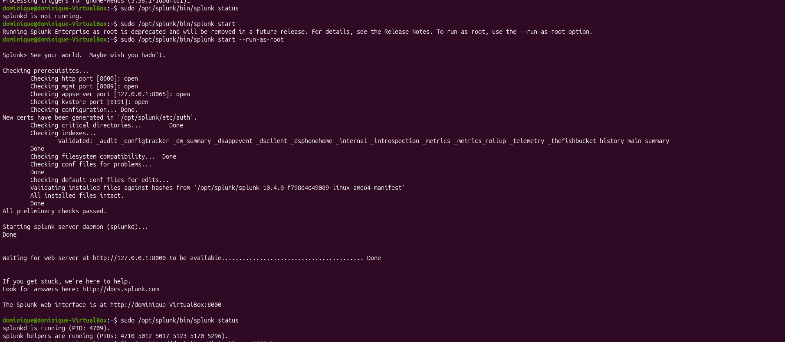

  3. Accessed the Splunk Web Interface through a web browser:
     ``` bash
     http://localhost:8000
     ```
     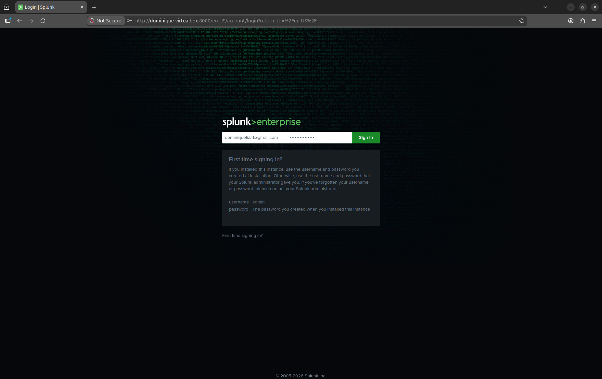

  4. Verified dashboard access by logged into Splunk successfully:

     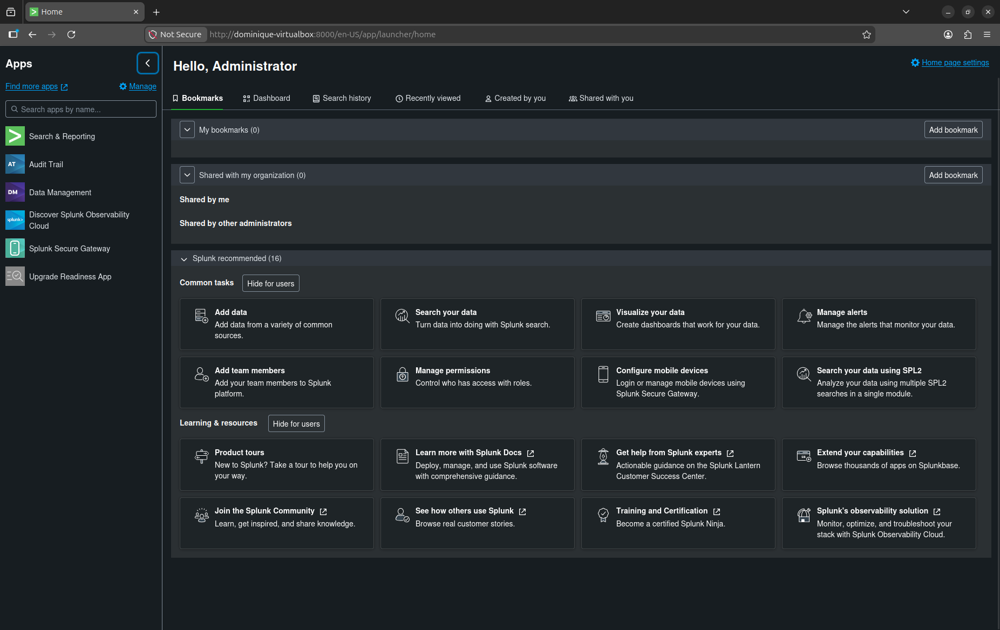
  
  5. Added a new data source in Splunk to ingest Linux authentication logs from `/var/log/auth.log`.   
     The authentication logs was configured using :
     - Monitor Type: Continuously Monitor
     - Source Path : `/var/log/auth.log`
     - Sourcetype: `linux_auth`
     - Index: main 

     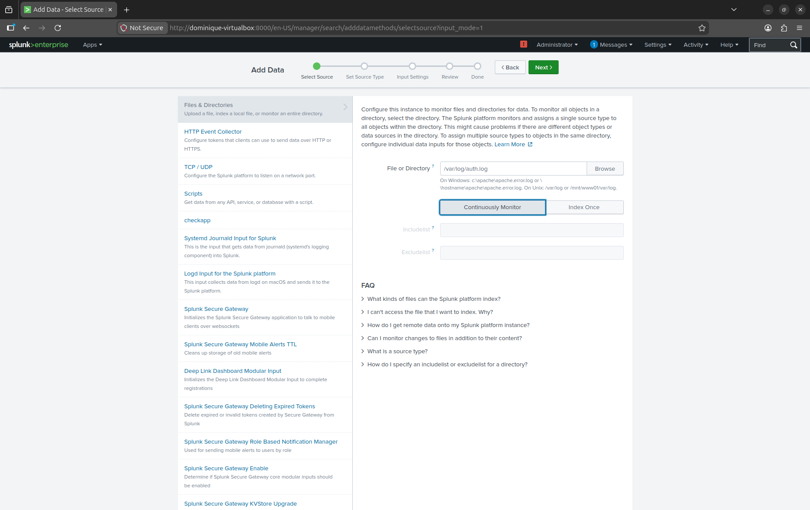
     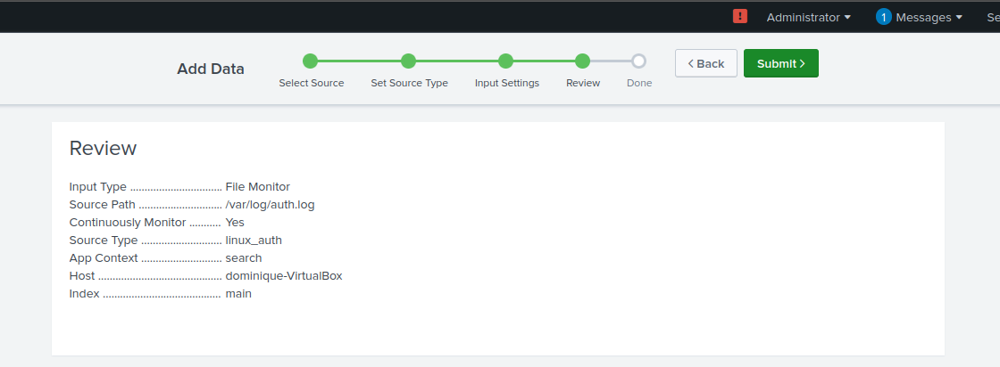
     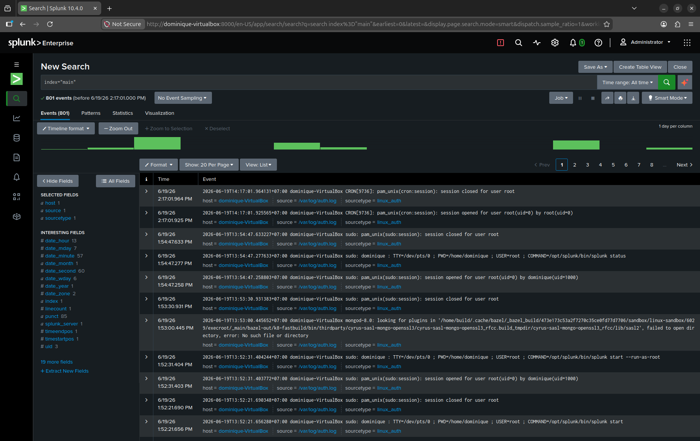

     This configuration allowed Splunk Enterprise to continuously collect and index authentication events generated by the Ubuntu Server.
     
  6. Generated failed SSH authentication attempts from the Kali Linux client machine using an invalid username.
      ```bash
      ssh fakeuser@192.168.100.70
      ```
    After entering an incorrect password multiple times, Ubuntu Server rejected the authentication request and returned:

    Permission denied (publickey,password)
  
  7. monitored authentication events in real time using:
      ```bash
      sudo tail -f /var/log/auth.log
      ```
      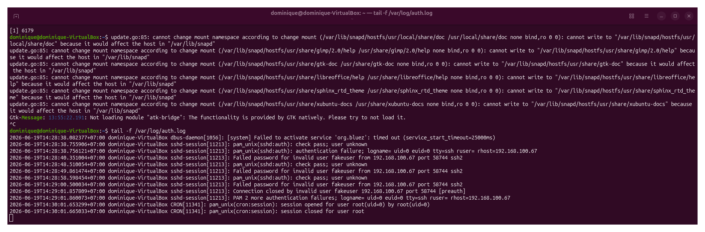
         
  8. Investigated the generated events in Splunk using the following searches:
      ``` bash
      index="main"
      index="main" "failed password"
      index="main" sshd
      index="main" "invalid user"
      ````
      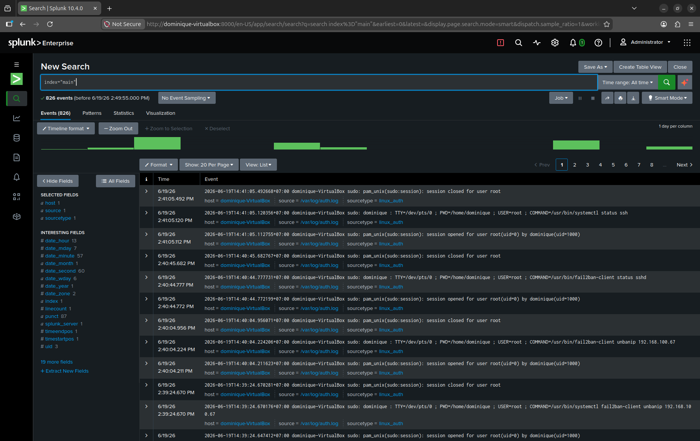
      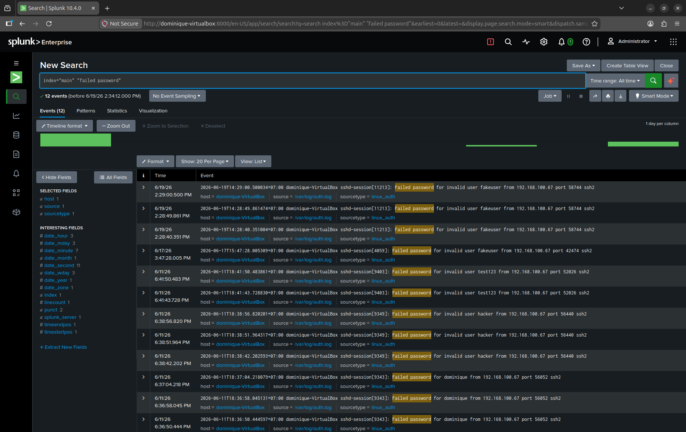
      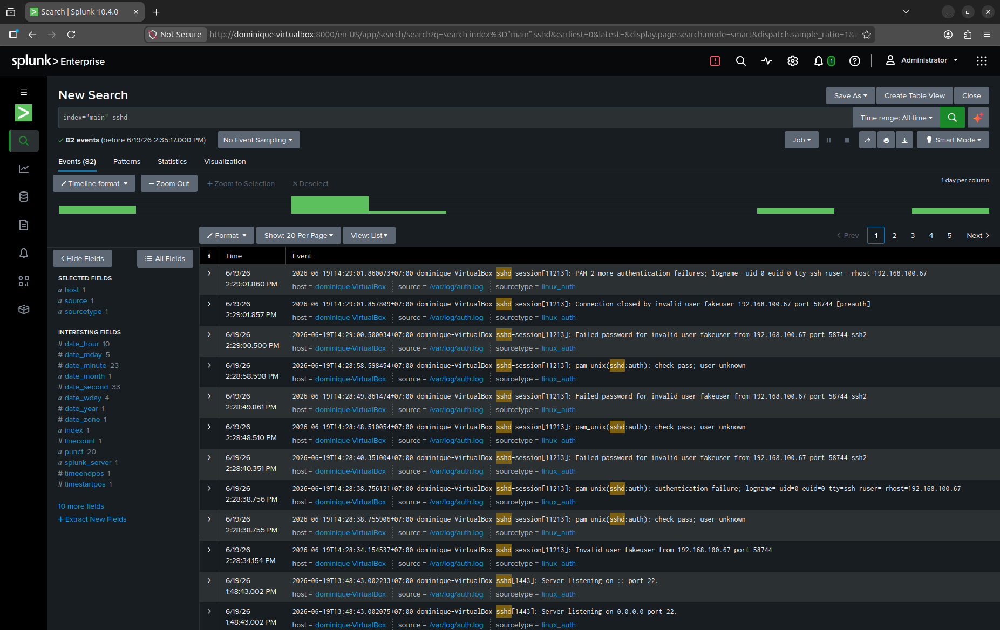
      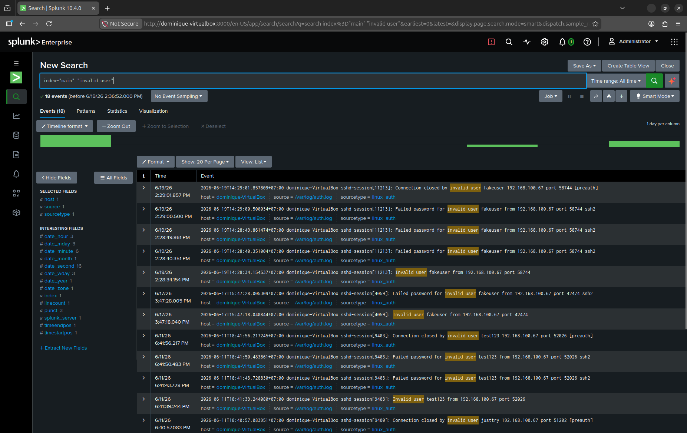   
  
  9. Verified the Fail2Ban status:
     ```bash
     sudo fail2ban-client status sshd
     ```        
  10. Removed the Kali Linux IP address from the Fail2Ban list:
     ```bash
     sudo fail2ban-client unbanip 192.168.100.67
     ``` 
---

## 📊 4. Practical Execution & Findings

* **Activity Executed:**
  - Verified Splunk Enterprise startup and operation
  - Accessed the Splunk Web Interface
  - Added data source to ingest Linux authentication logs from `/var/log/auth.log`
  - Generated failed SSH login attempts using an invalid username and incorrect passwords.
  - Monitored SSH authentication event in real time using:
    `sudo tail -f /var/log/auth.log`
  - Investigated authentication events in Splunk using the following searches:
    `index="main"
      index="main" "failed password"
      index="main" sshd
      index="main" "invalid user"`
  - Verified the banned IP address using using:
    `sudo fail2ban-client status sshd`
  - removed the banned IP address on the Fail2Ban IP banned list using:
    `sudo fail2ban-client unbanip client_ip_address`
* **Key Observations:**
  - Authentication events from `/var/log/auth.log` were successfully ingested into Splunk Enterprise.
  - Failed SSH login attemps generated from the Kali Linux client machine were visible in both Ubuntu authentication logs and Splunk search results.
  - Search using `index=main` `sshd`, `Failed password`, and `Invalid user` successfully identified authentication-related events.
  - Authentication events contained useful investigation data, including timestamps, usernames, source IP addresses, and authentication status.
  - Fail2Ban detected repeated failed authentication attempts and automatically blocked the Kali Linux client IP address.
  - The blocked IP address was successfully identified and removed from the Fail2Ban ban list to continue testing.
  - The exercise demonstrated how Linux authentication logs can be collected, monitored, and investigated using Splunk Enterprise.
---

## 🚀 5. Key Takeaways & Career Alignment
* **Conclusion:**
Successfully monitored and investigated Linux authentication events using Splunk Enterprise. This lab demonstrated how authentication logs can be collected, indexed, and analyzed through a SIEM platform to identify failed login attempts, invalid usernames, and other authentication-related security events.
By ingesting /var/log/auth.log into Splunk and performing searches using SPL queries, I gained practical experience with log ingestion, event investigation, and authentication monitoring workflows commonly used by SOC analysts. The exercise also demonstrated how Fail2Ban can automatically detect and respond to suspicious authentication activity by temporarily blocking offending IP addresses.
This project established a foundation for future SIEM investigations, detection engineering, alert creation, and SOC monitoring activities.
* **L1 SOC Skill Demonstrated:**
  - Linux log analysis
  - Authentication monitoring
  - SIEM log ingestion
  - Splunk search and investigation (SPL)
  - Event correlation and analysis
  - SSH authentication investigation
  - Security monitoring
  - Fail2Ban security control validation
  - Incident investigation and troubleshooting
  - Log-based detection fundamentals
* **Next Steps:**
  - Create Splunk dashboards to visualize failed SSH login attempts, source IP addresses, and authentication trends.
  - Build Splunk alerts to detect excessive authentication failures and potential brute-force activity.
  - Develop additional SPL queries for deeper authentication event investigation.
  - Analyze brute-force attack patterns using centralized security logging.
  - Expand monitoring coverage by ingesting additional Linux logs such as system logs, firewall logs, and service logs.
  - Integrate cloud security logs such as AWS CloudTrail for future cloud monitoring projects.
## 🛠 Skills Practiced
 - SSH authentication analysis
 - Linux authentication log monitoring
 - Splunk Enterprise configuration and log ingestion
 - SPL query creation and event searching
 - Failed password and invalid user investigation
 - Linux command-line operations
 - Fail2Ban administration
 - IP ban verification and remediation
 - Security event investigation
 - Incident troubleshooting workflow
 - Technical documentation and reporting

