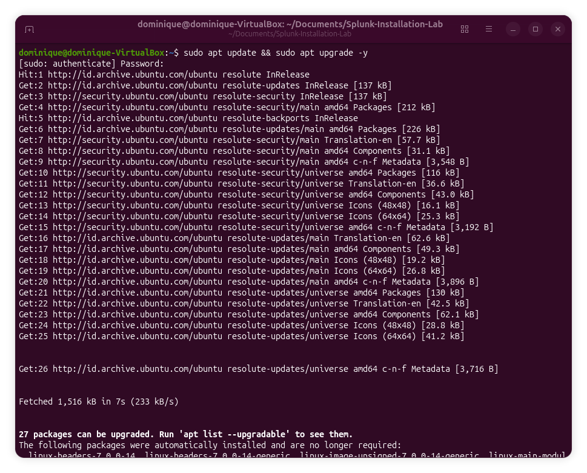
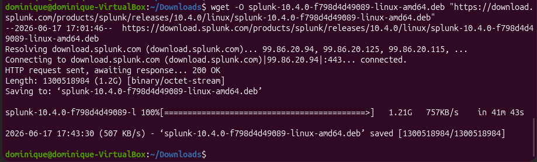
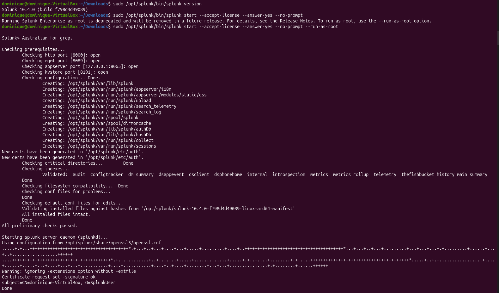
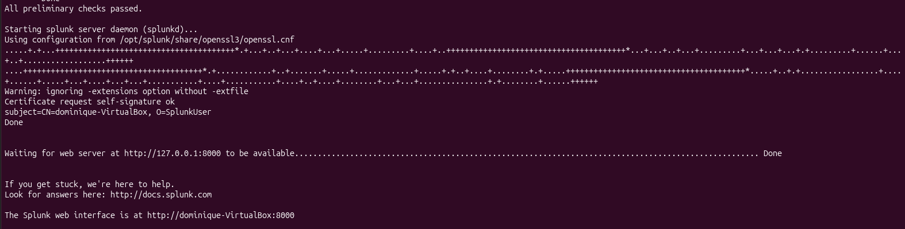
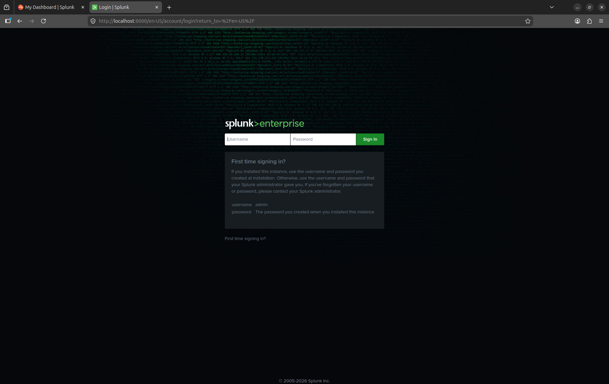
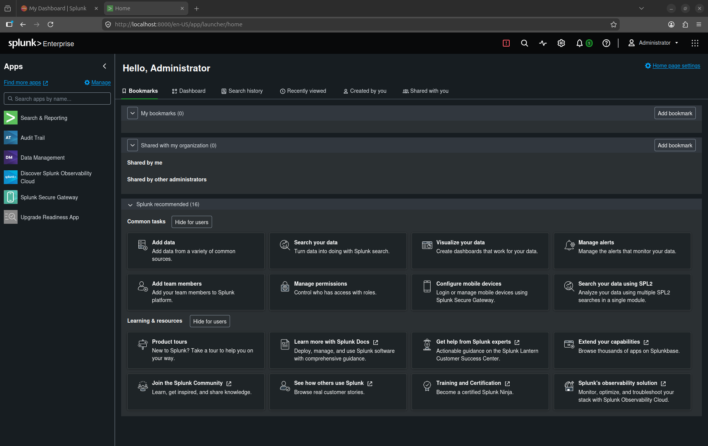

# Splunk Installation

## 📌 1. Project Objective
The objective of this lab was to gain hands-on experience with Security Information and Event Management (SIEM) technology by installing and configuring Splunk Enterprise on an Ubuntu Server virtual machine

The lab focused on :
- Installing Splunk Enterprise on Ubuntu Server
- Verifying successful installation and service operation
- Accessing the Splunk Web Interface
- Understanding the basic Splunk deployment process
- Preparing the environment for future log ingestion and security monitoring activities
---

## ⚙️ 2. Lab Specifications & Tools

* **Hypervisor / Platform:** Oracle VM VirtualBox 
* **Operating System(s):**
  - Kali Linux (Client Machine)
  - Ubuntu Server (Server Machine)
* **Security Tools Used:**
  - Splunk Enterprise 10.4.0
  - Linux Terminal
  - wget
  - dpkg

### Hardware Resource Profiles:


| Component | Allocation | Purpose |
| :--- | :--- | :--- |
| **Memory (RAM)** | 2048 MB | Provides sufficient memory for Ubuntu Server and Splunk Enterprise during installation and basic operation. |
| **Processors** | 2 vCPUs | Supports virtualization, system performance, and the Splunk Web Interface. |
| **Network Mode** | Bridged Adapter | Allows direct network communication between Kali Linux and Ubuntu Server for future security testing and monitoring activities. |


---

## ⚠️ 3. Engineering Challenges & Troubleshooting

### Incident / Roadblock: 
During the installation process, the Splunk Enterprise package was not found in the Ubuntu Downloads directory after attempting a browser-based download.

* **The Problem:**
  The Splunk Enterprise installation package could not be found in the Ubuntu Downloads directory after attempting to download it.
* **Root Cause:**
  The exact cause could not be confirmed. However, the installation package was not successfully saved to the expected Downloads directory after the initial download attempt.

* **The Resolution Workflow:**
  To resolve the issue, the Splunk Enterprise package was downloaded directly through the Linux terminal using wget.

After the download was verified, the following steps were performed:
  1.  Updated Ubuntu server packages using:
     ```bash
     sudo apt update && sudo apt upgrade -y
     ```
     
     
  2. verified operating system information using:
     ```bash
     hostnamectl
     ```
       

   3. Downloaded Splunk Enterprise package using wget       
       

   4. Installed Splunk Enterprise package using dpkg:
     ``` bash
     sudo dpkg -i splunk*.deb
     ```
       

   5. Verified Splunk installation path using:
     ```bash
     ls /opt/splunk
     ```
     
  
   6. Started Splunk Enterprise using:
     ```bash
     sudo /opt/splunk/bin/splunk start --accept-license --answer-yes --no-prompt --run-as-root
     ```
      
   
   7. Accessed the Splunk Web Interface through a web browser :
      ```bash
      http://localhost:8000
      ```
      
       
  
   8. Verified dashboard access by Logged into Splunk successfully:
     
      
               
   9. Checked service status of Splunk Enterprise using:
      ```bash
      sudo /opt/splunk/bin/splunk status
      ```
      

  This confirmed that Splunk Enterprise was running successfully and operational..

### Result:
Splunk Enterprise was successfully installed on the Ubuntu Server virtual machine.

The Splunk service started successfully, the web interface was accessible through port 8000, and service status verification confirmed that Splunk was running correctly.

This environment is now ready for log ingestion, authentication monitoring, and security investigation activities in future projects.

---

## 📊 4. Practical Execution & Findings

* **Activity Executed:**
  - Installed Splunk Enterprise on Ubuntu Server
  - Verified service startup and operation
  - Accessed the Splunk Web Interface
  - Confirmed successful deployment through service status checks
* **Key Observations:**
  - Splunk Enterprise was installed successfully using the Linux terminal.
  - The Splunk Web Interface became accessible on port 8000.
  - Service status verification confirmed that Splunk was operational.
  - The environment was successfully prepared for future log ingestion and monitoring activities.
---

## 🚀 5. Key Takeaways & Career Alignment
* **Conclusion:**
Successfully deployed and configured Splunk Enterprise on an Ubuntu Server virtual machine. Through this lab, I gained hands-on experience with Linux administration, SIEM deployment, service verification, and troubleshooting.

This environment will be used as the foundation for future projects involving log ingestion, authentication monitoring, security investigations, detection engineering, and SOC analyst workflows.

* **L1 SOC Skill Demonstrated:**
  - Linux administration
  - Software installation and configuration
  - Service management
  - Basic SIEM deployment
  - Troubleshooting and problem resolution
    
* **Next Steps:**
  - Ingest Linux authentication logs (auth.log)
  - Ingest system logs (syslog)
  - Perform SSH authentication monitoring
  - Create Splunk alerts and dashboards
  - Conduct basic security investigations
    
## 🛠 Skills Practiced
 - Linux
 - VirtualBox
 - Splunk Enterprise
 - Package Management
 - System Administration
 - Troubleshooting
 - SIEM Fundamentals
