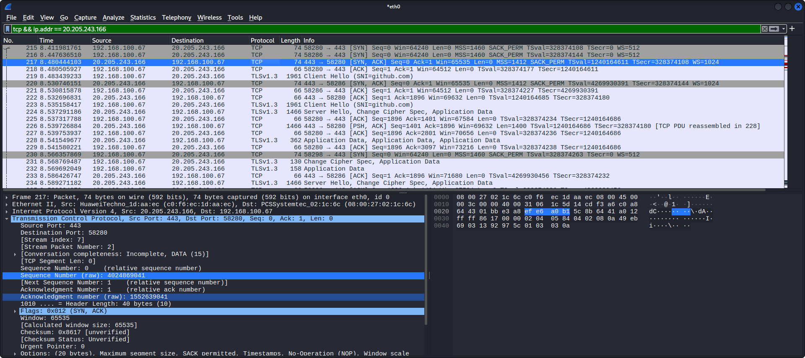

# TCP 3 Way Handshake understanding with Wireshark

## 📌 1. Project Objective
The objective of this lab was to learn TCP 3 Way Handshake practically using Wireshark in Kali linux Virtual Machine environment

The lab focused on:
- capturing live network traffic of TCP 3 handshake
- analyzing SYN, SYN-ACK, and ACK packets generated from Github.com
- documenting and capture TCP 3 Way Handshake by sequence raw number and ack number

---

## ⚙️ 2. Lab Specifications & Tools

* **Hypervisor / Platform:** Oracle VM VirtualBox 
* **Operating System(s):** Kali Linux
* **Security Tools Used:** Wireshark

### Hardware Resource Profiles:


| Component | Allocation | Purpose |
| :--- | :--- | :--- |
| **Memory (RAM)** | 4096 MB | Prevents application lag and data drops during active packet capture processing. |
| **Processors** | 2 vCPUs | Required for smooth real-time multi-threaded packet dissection and interface rendering. |
| **Network Mode** | Bridged Adapter | Allows the virtual machine to bypass NAT restrictions and sniff live local network interfaces. |


---

## ⚠️ 3. Engineering Challenges & Troubleshooting

### Incident / Roadblock: 
Ensuring TCP traffic visibility and identifying DNS SYN, SYN-ACK, and ACK packets correctly inside Wireshark.

* **The Problem:**
During live packet capture, Wireshark displayed multiple network protocols simultaneously, making it difficult to isolate DNS-related traffic clearly. Additional filtering and packet inspection were required to identify DNS query and response communication generated from the `tcp && ip.addr==20.205.243.166` requests and to verify successful 3 way handshake of TCP.

* **The Resolution Workflow:** 
  1. Open VirtualBox and Start Kali Linux.
  2. Relaunch Wireshark using:
  ```bash
  wireshark &
     ```
  3. Confirmed that the `eth0` interface appeared correctly and verified that live network traffic could be captured successfully.

     
     
  4. open website by mozilla firefox for TCP 3 way handshake with github.comm
       
     to generate and capture live network traffic using Wireshark
     
  5. Applied the `tcp && ip.addr==20.205.243.166` display filter in Wireshark to verify that Wireshark successfully captured the TCP 3 way handshake traffic generated by the tcp and ip address of domain requests.
      
  

  6. Check on the tcp syn request of github.com by client with port 58280 to server with port 443 successfully by check on sequence number(raw) = 1552639040
  

  7. Check on the response of github.com as server with port 443 to client with port 58280 successfully response by sent acknowledge and request synchronization to client by new sequnce number = 4024869041 and acknowledgement number (raw) = 1552639041

  

  7. Check on the response of client with port 58280 to github.com as server with port 443 successfully sent acknowledge to server by sequnce number = 1552639041 and new acknowledgement number (raw) = 4024869042

  
  8.Exported the packet capture file generated during tcp-3-way-handshake for future investigation and traffic-review practice

  the packet capture file was saved as:
  tcp-3-way-handshake.pcapng
  and store inside the `pcaps/` directory
  

---

## 📊 4. Practical Execution & Findings

* **Activity Executed:**
  - Captured live traffic network generated from github.com
  - use `nslookup` to find ip address of github.com 
  - Applied `tcp && ip.addr=20.205.243.166` on display filter of Wireshark to isolate TCP 3 Way Handshake of github.com.

* **Key Observations:**
  - Wireshark successfully captured DNS query and response packets generated from the nslookup command.
  - The packet capture confirmed successful DNS communication between the Kali Linux virtual machine and external DNS servers.
  - The `dns` filter helped simplify packet analysis by isolating only DNS-related traffic.
  - Packet timestamps,queries domain, and resolved IP addresses became visible during live traffic analysis.
---

## 🚀 5. Key Takeaways & Career Alignment
* **L1 SOC Skill Demonstrated:**
  - Basic packet capture and traffic analysis
  - Understanding of DNS protocol behavior
  - Network interface toubleshooting
  - Virtual machine networking configuration
  - Beginner-level wireshark filtering and packet inspection 
* **Next Steps:**
  - Study TCP 3-way handshake behavior
  - Compare HTTP and HTTPS traffic visibility
  - Continue building beginner SOC and network-analysis projects
## 🛠 Skills Practiced
  - VirtualBox networking
  - Basic Networking Troubleshooting
  - Packet Capture
  - DNS Traffic Analysis
  - Wireshark Filtering
  - Export `.pcap` files for future log-analysis practice
  - Documentation and Technical Reporting
